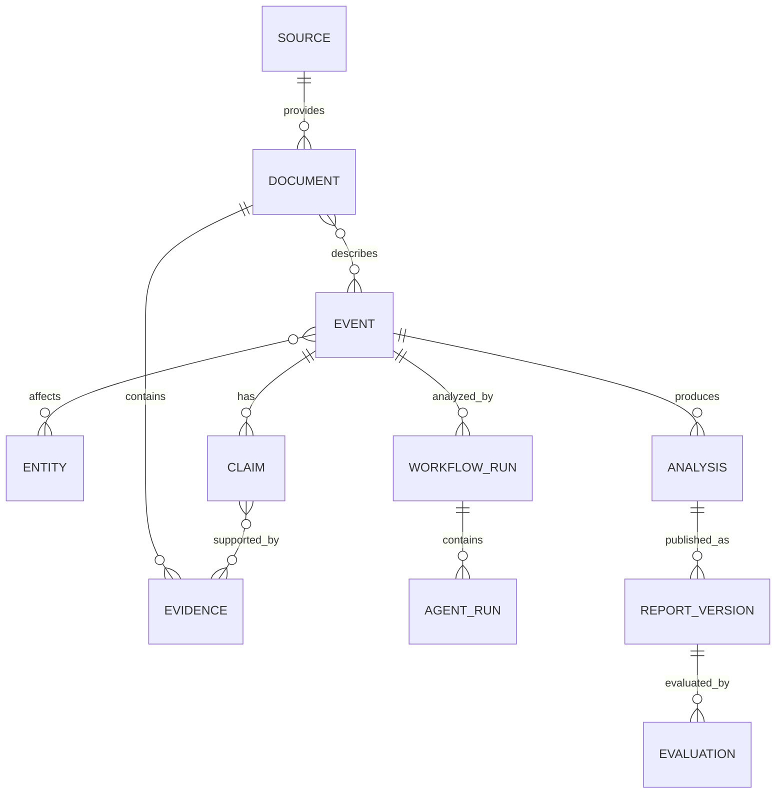

# 核心数据模型

## 1. 建模目标

数据模型必须支持事件合并、证据引用、工作流恢复、结论版本化和无未来数据泄漏的回测。所有核心对象使用稳定 ID，并同时记录业务发生时间与系统写入时间。

## 2. 核心对象关系

## 3. 关键对象

| 对象 | 必要字段 | 说明 |
| --- | --- | --- |
| Source | id、name、tier、type、license、status | 数据源及可信等级 |
| Document | id、source_id、url、published_at、ingested_at、content_hash、raw_uri | 不可变原始文档 |
| Event | id、type、status、importance、urgency、occurred_at、version | 事件主对象 |
| Entity | id、type、canonical_name、market_code | 公司、行业、人物或资产 |
| Evidence | id、document_id、locator、excerpt、hash | 可精确定位的原始依据 |
| Claim | id、event_id、subject、predicate、object、status、confidence | 待验证或已验证事实 |
| WorkflowRun | id、event_id、state、budget、started_at、ended_at | 一次可恢复执行 |
| AgentRun | id、workflow_id、agent_type、input_version、output、status、trace_id | Agent 审计记录 |
| Analysis | id、event_id、type、payload、confidence、as_of | 结构化分析结果 |
| ReportVersion | id、event_id、version、content、status、supersedes_id | 不可覆盖的报告版本 |
| Evaluation | id、report_version_id、horizon、metric、value、as_of | 后续市场与质量评估 |

## 4. 时间与版本语义

- `occurred_at`：事件实际发生时间。
- `published_at`：来源公开发布时间。
- `ingested_at`：系统首次获取时间。
- `as_of`：分析当时允许使用的数据截止时间。
- `created_at`：对象写入时间。

回放和评估只能读取 `published_at <= as_of` 且当时已被系统获取的数据。原始文档、Agent 输出和报告版本采用追加写，不做就地覆盖。

## 5. 状态枚举

事件状态：`ingested`、`triaged`、`researching`、`needs_review`、`published`、`dormant`、`archived`。

事实状态：`unverified`、`verified`、`conflicted`、`rejected`。

运行状态：`pending`、`running`、`waiting_review`、`succeeded`、`failed`、`cancelled`。

报告状态：`draft`、`review_required`、`published`、`superseded`、`withdrawn`。

状态迁移由领域服务执行，并写入审计日志。

## 6. 存储建议

- PostgreSQL：事件、实体、事实、工作流、报告和权限数据。
- 对象存储：PDF、HTML 快照、附件及不可变 Agent 大对象输出。
- pgvector/OpenSearch：语义检索和全文检索，不作为事实真值源。
- Redis：短期锁、任务队列、限流和工作流缓存，不存唯一业务事实。
- ClickHouse：规模增长后存放行情、运行明细和评估时序数据。

## 7. 数据质量约束

- 已验证 Claim 至少关联一个 S/A 级证据，或两个独立的较低等级来源。
- 关键数字必须保存单位、币种、期间和会计口径。
- URL 不是证据唯一标识，必须保存内容 Hash 和原文快照位置。
- Event 合并必须保留全部原事件 ID 和合并原因。
- 删除采用受控软删除；审计、报告历史和评估记录不可级联删除。

## 8. 待决策事项

- 首期行业分类采用申万、中信还是内部统一行业树。
- 公告原文和新闻全文的保存期限及版权限制。
- 公司行动导致证券代码变化时的实体版本策略。
- 知识图谱首期采用 PostgreSQL 关系表还是独立图数据库。

