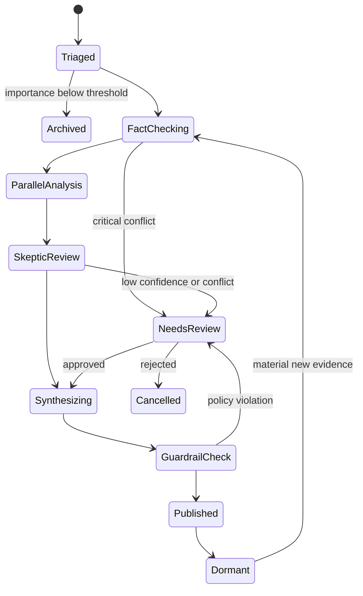

# 事件工作流与 Agent 编排

## 1. 工作流边界

每个事件创建独立工作流。工作流只负责编排研究任务，不负责采集原始数据、用户分发或修改投资组合。

## 2. 主流程

## 3. 节点输入输出

| 节点 | 输入 | 输出 | 是否使用模型 |
| --- | --- | --- | --- |
| Triage | 文档、实体候选、规则特征 | 类型、重要度、所需 Agent | 是 |
| Fact Check | 原文和官方检索结果 | 事实、冲突、未验证声明 | 是 |
| Company Analysis | 已验证事实、财务数据 | 情景和财务影响 | 是，计算走工具 |
| Industry Analysis | 事实、知识关系 | 传导链和相关实体 | 是 |
| Expectation Analysis | 事实、预期和行情 | 预期差、定价程度 | 是，指标走工具 |
| Skeptic Review | 全部专项分析 | 反证和修正置信度 | 是 |
| Synthesis | 已有结构化结果 | 研究结论 | 是，禁止新搜索 |
| Guardrail | 报告、引用和策略 | 通过、拦截或人工审核 | 规则优先 |

## 4. 并行与依赖

事实核验是强前置节点。公司、行业和市场预期分析可并行，但只能使用当前 `as_of` 下的已验证事实。Skeptic 必须等待所有被 Router 选中的专项 Agent 完成或明确降级。Synthesis 不得读取未审核的自由文本草稿。

## 5. 预算与终止

Supervisor 为每个工作流设置最大模型调用数、工具调用数、Token、费用和执行时间。超过软阈值时停止扩展搜索；超过硬阈值时保存检查点并转人工审核或降级输出，禁止无限循环。

## 6. 重试、幂等与恢复

- 每个节点以 `workflow_id + node + input_version` 作为幂等键。
- 网络和限流错误采用指数退避；Schema 错误最多自动修复一次。
- 权限错误、证据冲突和预算耗尽不自动重试。
- 节点成功后保存结构化输出和检查点；恢复时从最后成功节点继续。
- 同一事件同时只允许一个主写工作流，补充评估任务可并行运行。

## 7. 人工审核条件

- S/A 级来源之间出现关键数字或主体冲突。
- 事件合并置信度低于阈值。
- 结论置信度低，但影响等级高。
- 报告含强投资措辞、敏感主体或无法定位的关键引用。
- Agent 之间方向冲突且 Skeptic 无法消解。

## 8. 局部重分析

新证据首先生成差异集：新增、修改、撤回和冲突事实。Supervisor 根据差异决定最小重跑范围。任何重跑都会创建新的 WorkflowRun 和 ReportVersion，不修改原运行结果。

## 9. Agent 输出约束

- 必须通过版本化 JSON Schema 校验。
- 每个判断区分事实、假设和推论。
- 数值携带来源或计算工具调用 ID。
- 引用使用 Evidence ID，不在输出中复制不可追踪 URL。
- 置信度需说明影响它的主要因素，不能只返回分数。

## 10. 降级策略

当模型或非关键数据源不可用时，系统可发布“事实卡片”，但不得伪装成完整研究报告；当官方来源不可用时，保留事件并标记待核验；当行情数据延迟时，省略预期差模块并在报告中明确披露。

