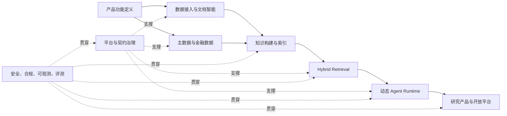

# 金融智能 Agent 平台待开发清单

> 最后更新：2026-08-14（WP-08 Agent Runtime 已交付，WP-09 多租户安全与 WP-10 平台 SLO 待启动）。状态符号：`[x]` 已具备可复用基础，`[-]` 已部分实现，
> `[ ]` 待开发。本文面向目标平台架构，不以 MVP 范围或当前数据规模降低架构标准。

## 1. 目的与执行原则

本文将 [RAG 平台设计](./Financial_Intelligence_Agent_Platform_Design_with_RAG.md)、
[当前工作进度](./07-work-progress.md)和[改进项 Backlog](./08-improvement-backlog.md)
整合为平台级开发清单，目标是建设：

> 多租户、事件驱动、证据可追溯、时态一致的金融 Agentic Intelligence Platform。

执行原则：

- 目标架构优先：实施可分阶段，但临时实现不得替代正式领域模型和服务边界。
- 证据优先：事实、推断、假设和分析意见分层存储，所有结论可回溯到来源。
- 双时态优先：业务有效时间与系统获知时间同时建模，研究和评估严格服从 `as_of`。
- 契约优先：API、事件、工具和 Agent 输入输出使用显式、版本化 Schema。
- 控制面与数据面分离：配置、策略和发布治理不与高吞吐执行路径耦合。
- 事件驱动一致性：跨存储派生数据通过 Outbox、幂等消费者和一致性巡检维护。
- 平台安全内建：租户隔离、许可、数据保留、模型出境和审计不是后补功能。
- 可评测发布：模型、Prompt、Embedding、Reranker、索引和规则变更均受质量门禁约束。

## 2. 当前可复用基础

以下能力已存在，应作为平台演进的基础，而不是另起一套旁路实现：

- [x] FastAPI、Pydantic、SQLAlchemy、Alembic、PostgreSQL Repository 和内存测试适配器。
- [x] Redis Streams Outbox/Inbox、去重、重试和死信基础。
- [x] Source、Document、Artifact、DocumentRevision 和内容寻址存储基础。
- [x] Event、Entity、Security、EntityAlias、EventEntity 和事件匹配审计基础。
- [x] Claim、Evidence、Conflict、来源独立性和 Evidence Policy 基础。
- [x] `as_of` 查询约束、未来数据拒绝和回放测试基础。
- [x] LangGraph、Blackboard、Checkpoint、节点幂等、预算、重试和人工恢复基础。
- [x] Model Gateway、供应商配置、模型运行审计和版本化 Agent Schema 基础。
- [x] Tool Gateway 白名单、参数校验、调用审计和 Prompt 注入防护基础。
- [x] Report、Citation、Guardrail、Review、Brief 和发布状态流转基础。
- [x] JWT、RBAC、审计日志、来源许可和文档保留基础。
- [x] React 管理端、后端测试、迁移测试和 CI 基础。
- [-] PDF/OCR、实体解析、事件聚类、生产可观测和真实数据源仍需平台化增强。
- [ ] Hybrid Retrieval、金融数据平台、知识图谱、动态研究计划和多租户尚未建立。

## 3. 目标能力域与开发清单

### 3.1 Intelligence Products 与开放平台

- [ ] **PROD-001：建设交互式研究工作台。**
  - 支持问题、研究计划、检索轨迹、证据、反证、计算、结论和引用联动展示。
  - 完成条件：用户可从任何结论下钻至 Claim、Evidence、Revision 和原始来源。

- [-] **PROD-002：升级事件、公司、行业和风险工作台。**
  - 在现有管理端基础上增加时间线、知识图、财务指标、同行比较和持续监控。
  - 完成条件：运营管理界面与研究产品界面职责分离。

- [ ] **PROD-003：建设订阅、预警和持续研究。**
  - 支持实体、事件类型、主题、指标和风险条件订阅；事件变化触发研究增量更新。
  - 完成条件：预警去重、升级、确认、抑制和通知审计完整。

- [-] **PROD-004：建设机构级报告与发布平台。**
  - 扩展模板、协作、评论、版本、审批、签发、撤回、替代、导出和水印。
  - 完成条件：发布职责分离、许可检查和引用完整性是不可绕过的事务门禁。

- [ ] **PROD-005：建设 OpenAPI、SDK、Webhook 和数据导出。**
  - 提供异步研究任务、流式进度、批量查询、事件订阅和受控数据导出。
  - 完成条件：版本、配额、幂等、签名、审计和弃用策略完整。

### 3.2 数据接入与治理平台

- [-] **DATA-001：将现有 Fetcher 演进为 Connector SDK。**
  - 统一 `discover/fetch/checkpoint/normalize/validate/publish` 生命周期。
  - 支持批量、流式、CDC、Webhook 和文件投递；定义连接器能力声明与配置 Schema。
  - 完成条件：连接器可独立发布、升级、限流、暂停、回放并报告 SLA。

- [ ] **DATA-002：建设数据源目录和数据合同。**
  - 管理所有者、覆盖市场、许可、频率、字段质量、数据驻留和下游用途。
  - 完成条件：未登记许可或未通过合同校验的数据不能进入知识和检索层。

- [-] **DATA-003：完善数据质量、隔离与重放。**
  - 扩展现有 quarantine，增加 Schema、完整性、及时性、重复率和漂移规则。
  - 完成条件：质量异常可定位到 Source、批次、记录和规则版本，并可选择性重放。

- [ ] **DATA-004：引入平台事件总线。**
  - 评估并部署 Kafka 或 Pulsar；保留 Outbox/Inbox 作为事务一致性边界。
  - 领域事件至少覆盖文档、解析、Chunk、Embedding、实体、事件、Claim、索引、
    研究、报告、许可和删除。
  - 完成条件：事件有 Schema、幂等键、顺序语义、重放策略、DLQ 和消费延迟指标。

### 3.3 Document Intelligence Platform

- [-] **DOC-001：完善不可变文档与派生物模型。**
  - 在现有 Artifact/Revision 基础上增加 ParsedDocument、DocumentBlock、Table、
    Figure、OCRRegion 和 ParserRun。
  - 完成条件：任何派生对象都能追溯原件、Revision、解析器和参数版本。

- [ ] **DOC-002：建设语义 Chunking Pipeline。**
  - 支持事件描述、财务影响、市场反应、背景、表格和脚注等金融语义 Chunk。
  - 定义 DocumentChunk、ChunkRelation、`chunker_version` 和稳定 Locator。
  - 完成条件：Chunk 重建不破坏历史引用，不同 Chunk 策略可并存和对比。

- [-] **DOC-003：建设 Embedding 生命周期。**
  - `EmbeddingRecord` 模型与 `ingestion.embedding_records` 表已落地，PostgreSQL 使用 pgvector `vector(1536)` 类型；`EmbeddingService` 支持本地确定性 Provider 和 OpenAI-compatible Provider；按 `chunk_id` + `model_version` 幂等生成；`DisclosureGroupService` 在 PostgreSQL 路径使用 pgvector `<=>` 余弦距离做 TOP-K 向量召回，SQLite/内存路径回退到应用层 brute-force。
  - 剩余：全量重建、蓝绿切换、失败恢复、版本回滚。

- [ ] **DOC-004：实现跨存储删除和许可传播。**
  - 文档软删、purge、retention hold 和 license 变化传播到对象存储、缓存、向量库、
    图数据库和分析存储。
  - 完成条件：一致性巡检无孤儿派生物，删除演练提供可验证审计证据。

### 3.4 Entity、Reference Data 与事件平台

- [-] **KNOW-001：建设金融 Entity Master Data。**
  - 扩展 LegalEntity、ListedCompany、Security、Exchange、Person、Product、
    Industry、Geography、Currency、IdentifierMapping 和 CorporateAction。
  - 完成条件：跨市场、多证券、历史名称、公司行动和歧义实体可双时态解析。

- [-] **KNOW-002：完善 Event Store 和事件演化。**
  - 增加 EventVersion、EventStage、EventCluster、ParentEvent、EventRelation、
    EventImpact、EventTimeline 和 EventCorrection。
  - 完成条件：多来源、阶段更新、合并、拆分、替代和回溯修正均不覆盖历史。

- [-] **KNOW-003：将证据中心演进为知识层。**
  - 明确 Verified Fact、Derived Knowledge、Hypothesis 和 Analyst Opinion 四层对象。
  - 增加 Claim supersession、有效时间、推导链、规则/模型来源和审核状态。
  - 完成条件：任何知识节点可解释其证据、推导过程和可信等级。

- [ ] **KNOW-004：建设版本化金融知识图谱。**
  - 节点覆盖 Entity、Security、Person、Product、Industry、Event、Claim、
    Document、Metric、Regulation 和 RiskFactor。
  - 关系记录来源、有效时间、系统时间、置信度、提取方法、版本和审核状态。
  - 完成条件：事实边与推断边物理或逻辑隔离，支持历史截面和关系纠错。

### 3.5 Financial Data Platform

- [ ] **FIN-001：建设金融数据标准模型。**
  - 定义 FinancialStatement、FinancialMetricObservation、MarketBar、
    CorporateAction、ConsensusEstimate、MacroObservation 和 TradingCalendar。
  - 完成条件：原始值、标准化值、币种、单位、期间、口径、供应商和修订均可追溯。

- [ ] **FIN-002：建设湖仓与分析存储。**
  - 对象存储加 Parquet/Iceberg 保存历史与重算数据；ClickHouse 承担大规模行情、
    指标和横截面分析；PostgreSQL 保存目录、事务元数据和主数据。
  - 完成条件：冷热分层、分区、压缩、生命周期、重算和灾备策略通过容量评审。

- [ ] **FIN-003：接入权威财务、行情和宏观数据源。**
  - 每个供应商使用独立 Adapter，保留原始快照、字段映射和质量分。
  - 完成条件：断点恢复、修订传播、交易日对齐和供应商差异检测自动化。

- [ ] **FIN-004：建设安全的金融计算服务。**
  - 提供收益、相对收益、估值、增长、盈利质量、事件窗口和情景计算。
  - 完成条件：计算使用类型化输入、确定性公式、版本化口径，禁止模型直接心算。

### 3.6 Hybrid Retrieval Platform

- [ ] **RAG-001：建设 Retrieval Control Plane。**
  - 管理 Retrieval Profile、Index Registry、Embedding/Reranker Registry、
    Query Template、Ranking Policy、Context Policy 和实验配置。
  - 完成条件：租户、Agent 和研究类型可绑定不同检索策略并支持灰度发布。

- [-] **RAG-002：定义统一版本化检索契约。**
  - 已落地核心 Schema：`RetrievalRequest`、`RetrievedItem`、`CitationCandidate`、
    `RetrievalTrace`（定义于 `app/domain.py`）。
  - 结果包含来源后端、文档/块 ID、摘录、locator、分项得分、检索时间、模型版本
    和过滤条件。
  - 剩余：`QueryPlan`、`ContextBundle`、血缘/许可/索引版本字段，以及
    Vector、Lexical、Graph、SQL 和 Time-series 全后端契约测试。

- [-] **RAG-003：建设多路 Retrieval Data Plane。**
  - Vector / Lexical / Hybrid 已落地（见 07-work-progress）。
  - Graph-like Retrieval 已落地：基于 Event/Entity/Document 关系在 PostgreSQL 上做关联召回，按跳数衰减打分。
  - Structured SQL Retrieval 已落地：按事件类型、时间窗、重要度过滤事件。
  - Time-series Retrieval 已落地：按时间窗倒序列出事件及相关文档块。
  - 剩余：Rerank、限流/熔断/部分降级策略、专用向量/图存储选型。

- [-] **RAG-004：建设 Query Understanding 与 Retrieval Planner。**
  - 规则化 Planner 已落地：`app/retrieval/planner.py` 支持实体最长匹配、ISO/相对时间窗提取、事件类型关键词映射、意图分类与后端选择；生成 `RetrievalPlan` 可被 `RetrievalService` 执行并写入 `RetrievalTrace`。
  - 剩余：LLM 增强的意图/实体消歧、市场/数据类型识别、受 Schema 约束的复杂并行计划、预算与 `as_of` 强制策略。

- [-] **RAG-005：建设 Fusion、Reranking 和 Context Assembly。**
  - 已落地：候选归一化（min-max）、RRF 与 weighted-score 融合、`chunk_id` 去重、
    来源多样性裁剪、`max_items`/`max_tokens` 上下文预算；`FusionService` 输出
    `backend_scores` 与 `backend_coverage` 审计字段。
  - 剩余：学习排序、Cross-encoder Rerank、冲突扩展、完整候选集与淘汰原因持久化、
    上下文版本管理。

- [ ] **RAG-006：建设向量索引平台。**
  - 分 Collection 管理 document chunks、events、claims、companies、reports、
    regulations 和 metric descriptions。
  - 完成条件：Milvus/Qdrant 选型有容量和质量基准，支持蓝绿索引、重建和回滚。

- [ ] **RAG-007：建设检索一致性巡检。**
  - 对照事务真值源检查向量、图、缓存和分析存储的缺失、过期与越权数据。
  - 完成条件：巡检可自动修复安全的派生数据问题，并对不可自动修复项告警。

### 3.7 Agent Runtime Platform

- [x] **AGENT-001：将固定工作流与动态研究运行时分层。**
  - 固定 `WorkflowService` 负责事件→FactCard 确定性链路；新增 `DynamicWorkflowService` 负责问题→计划→动态 DAG 执行。
  - 完成条件：两类工作流具有独立状态模型、失败语义和运维视图。

- [x] **AGENT-002：建设 ResearchPlan 和动态执行 DAG。**
  - `ResearchPlan` 包含目标、约束、任务、依赖、工具策略、证据要求、预算和完成标准；`DynamicWorkflowService` 手工拓扑调度，复用 Budget/Blackboard/NodeAttempt/ReviewTask。
  - 完成条件：计划可暂停、修改、局部重跑、比较和复现。

- [x] **AGENT-003：建设 Specialist Agent Registry。**
  - 已实现 `AgentRegistry` 声明式注册，内置 fact_checker、company_analyst、skeptic、synthesizer、planner、retriever、impact_analyst、market_analyst、industry_analyst、regulatory_analyst，支持按能力/输入输出/版本查找。
  - 完成条件：每个 Agent 的输入、输出、工具、模型、预算和质量门均可配置和版本化。

- [-] **AGENT-004：升级 Tool Gateway 为平台能力网关。**
  - 已扩展白名单覆盖所有动态 Specialist Agent（planner、retriever、impact_analyst、market_analyst、industry_analyst、regulatory_analyst）。
  - 剩余：租户、数据许可、调用配额、结果 Schema、服务身份、网络策略和敏感工具审批。
  - 完成条件：Agent 无法绕过网关直接访问数据库、图谱、向量库或外部服务。

- [ ] **AGENT-005：建设研究记忆与分层 Blackboard。**
  - 区分运行时状态、工作区记忆、实体长期记忆和已验证知识。
  - 完成条件：长期记忆写入必须经过证据与策略审查，并支持遗忘和租户隔离。

- [ ] **AGENT-006：明确 LangGraph、Temporal 与事件总线协作。**
  - LangGraph 承担 Agent 推理图，Temporal 承担跨服务长事务、超时和补偿，
    Kafka/Pulsar 承担事件传播。
  - 完成条件：跨组件恢复、重试和幂等边界有故障注入测试。

### 3.8 平台架构、租户与契约治理

- [ ] **PLAT-001：发布目标平台架构设计。**
  - 定义控制面、数据面、在线服务、异步作业和分析工作负载边界。
  - 明确 PostgreSQL、对象存储、ClickHouse、Milvus/Qdrant、Neo4j、Kafka、
    Redis、LangGraph 和 Temporal 的职责与容灾边界。
  - 完成条件：组件图、部署图、数据流、故障域、容量模型和 ADR 均通过评审。

- [ ] **PLAT-002：建立多租户领域模型。**
  - 增加 Tenant、Organization、Workspace、Membership、ServiceAccount 和 ApiKey。
  - 业务对象明确租户归属；PostgreSQL 执行行级隔离，缓存、对象存储、向量和图索引
    使用租户命名空间。
  - 完成条件：跨租户 API、检索、异步任务、导出和管理操作均有隔离测试。

- [ ] **PLAT-003：建设 Schema Registry 和兼容性策略。**
  - 管理 API Schema、领域事件 Schema、Agent Schema、Tool Schema 和检索 Schema。
  - 定义 backward/forward compatibility、弃用窗口、消费者版本和迁移规则。
  - 完成条件：不兼容 Schema 变更在 CI 中被阻止，生产可查询 Schema 使用关系。

- [ ] **PLAT-004：统一双时态、版本和血缘规范。**
  - 为主数据、财务数据、事件、关系、Claim 和索引定义 `valid_from/valid_to`、
    `available_at/recorded_at`、修订和替代语义。
  - 完成条件：任意历史 `as_of` 可恢复当时可见数据、索引版本和研究结果。

- [ ] **PLAT-005：建立策略控制面。**
  - 统一管理租户配额、数据许可、模型供应商、工具权限、研究预算、保留和发布策略。
  - 完成条件：策略版本可审计、可灰度、可回滚，运行记录保存实际生效版本。

### 3.9 安全、合规、可观测与评测

- [-] **OPS-001：建设统一 Intelligence Observability。**
  - Trace 串联 Query、Plan、Retrieval、Agent、Tool、Claim、Report 和 Review。
  - 指标覆盖数据新鲜度、索引延迟、检索质量、模型成本、工作流成功率和人工介入率。
  - 完成条件：生产故障可从用户结果追踪到数据、模型、索引和基础设施版本。

- [ ] **OPS-002：建设不可篡改审计与数据治理证据。**
  - 对许可、删除、模型出境、权限、审核和发布使用追加写审计及长期归档。
  - 完成条件：关键操作可生成合规审计包并验证完整性。

- [ ] **OPS-003：建设平台安全基线。**
  - 覆盖 OIDC/SSO、服务身份、密钥管理、网络分区、加密、供应链安全、数据驻留、
    Prompt 注入、模型数据使用和最小权限。
  - 完成条件：威胁模型、渗透测试、依赖扫描和权限审计进入发布门禁。

- [ ] **EVAL-001：建设 RAG 离线与在线评测。**
  - 指标覆盖 Recall@K、nDCG、MRR、引用精度、证据覆盖、时态泄漏、来源独立性、
    冲突召回、拒答率、延迟和成本。
  - 完成条件：Embedding、Reranker、索引和 Ranking Policy 变更必须通过冻结集和影子流量。

- [-] **EVAL-002：扩展 Agent 与金融分析评测。**
  - 在现有 Assessor 基础上增加事实一致性、方向、反证、情景、计算、校准和稳定性。
  - 完成条件：模型和 Prompt 变更有对照实验、显著性判断、回退门槛和自动发布阻断。

- [ ] **OPS-004：建设生产韧性和灾备。**
  - 定义跨可用区部署、备份、恢复、RPO/RTO、容量、限流、降级和故障演练。
  - 完成条件：数据库、对象、消息、向量、图谱和分析存储均完成恢复演练。

## 4. 建设顺序与依赖关系

以下是依赖顺序，不代表降低最终平台范围：

1. **产品能力定义**：PROD-001～005，先明确平台向研究人员和外部系统提供的能力。
2. **数据和知识功能**：DATA、DOC、KNOW、FIN。
3. **Hybrid Retrieval 功能**：RAG-001～007。
4. **Agent Runtime 功能**：AGENT-001～006。
5. **平台工程支撑**：PLAT-001～005，为上述能力提供正式部署和治理边界。
6. **生产保障**：OPS、EVAL、安全与合规要求在功能设计确定后集中列示，并在实施中同步接入。

关键依赖：

## 5. 近期应启动的架构工作包

以下工作包是后续平台开发的入口，完成前不宜直接堆叠孤立的 RAG 或 Agent 功能：

1. [x] **WP-04：Document Intelligence 与 Indexing 基础**
   - 已落地 `ParsedDocument`/`DocumentBlock`/`DocumentChunk`/`DisclosureGroup` 领域模型、Alembic 迁移、`DocumentParser`、`SemanticChunker`、`DisclosureGroupService`；`EventMatcher` 与 `EventResearchPipeline` 已接入 `disclosure_group_id`；Embedding 列与模型版本已预留 schema。精确 hash 去重已生效，语义向量 / MinHash 近重复为后续扩展点。验收证据：`tests/test_document_parser.py`、`tests/test_semantic_chunker.py`、`tests/test_disclosure_group.py`、`tests/test_pipeline_document_intelligence.py`；`uv run pytest` 366 passed / 1 skipped；`uv run ruff check .` 全绿。
2. [ ] **WP-05：Financial Data Platform LLD**
   - 输出标准财务模型、行情模型、数据湖、ClickHouse 和计算服务设计。
3. [ ] **WP-06：Knowledge Graph LLD**
   - 输出本体、关系来源、事实/推断分层、双时态和图谱纠错设计。
4. [x] **WP-07：Hybrid Retrieval LLD**
   - 已输出 `docs/design/05-hybrid-retrieval.md`；新增 `app/retrieval/planner.py` 与 `RetrievalService` 的 `graph`/`sql`/`timeseries`/`planned` 模式；新增 `POST /api/v1/retrieval/retrieve`；验收证据：`tests/test_retrieval_planner.py`、`tests/test_retrieval_api.py`、`uv run pytest` 全绿。
5. [x] **WP-08：Agent Runtime LLD（已完成）**
   - 已输出 `docs/design/08-agent-runtime.md`；新增 `ResearchPlan`/`ResearchTask`/`AgentRegistration` 领域模型、`app/agents/registry.py`、`app/workflows/planner.py`、`app/workflows/dynamic.py`、动态研究 API 与对应测试；固定工作流与动态运行时两层架构落地。
6. [ ] **WP-03：平台 Schema 包**
   - 输出 Query、Retrieval、Context、ResearchPlan、Knowledge 和领域事件 Schema。
7. [ ] **WP-01：目标平台架构与 ADR 包**
   - 输出服务边界、存储选型、事件架构、部署拓扑、容量模型和容灾设计。
8. [ ] **WP-02：统一时态、血缘和版本规范**
   - 输出跨领域字段规范、历史回放规则、删除传播和一致性协议。
9. [ ] **WP-10：平台 SLO 与评测门禁**
   - 输出可用性、新鲜度、索引延迟、研究延迟、质量、成本和恢复目标。
10. [ ] **WP-09：多租户、安全与合规 LLD**
   - 输出租户隔离、身份、服务权限、许可、数据驻留、模型出境和审计设计。

## 6. 清单维护规则

- 每个编号项必须关联设计、ADR、实现模块、迁移/API/事件和自动化验收证据。
- `[-]` 只表示具备部分基础，不表示目标平台能力已交付。
- 完成项必须同时满足功能、数据治理、安全、可观测、测试和运维要求。
- 新增基础设施前必须明确所有者、数据权威源、一致性协议、SLO 和退出方案。
- 当前实现与目标架构冲突时，应新增 ADR 和迁移计划，不静默替换历史设计。
- 本清单维护长期平台目标；短期交付进度继续在
  [工作进度清单](./07-work-progress.md)中维护。
