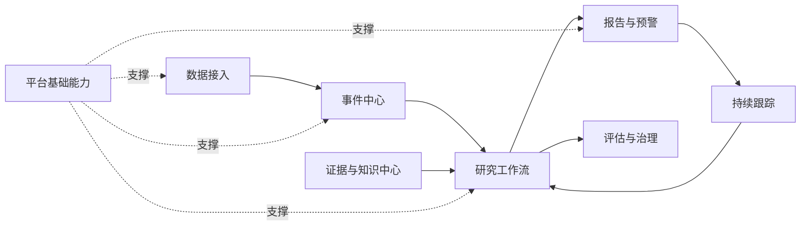

# FinSightAgent 文档总览

## 1. 文档目的

本目录承载总体方案，以及可直接用于产品设计、工程实现和项目验收的详细文档。总体愿景和核心原则见[总体方案](./financial_news_multi_agent_system.md)。

文档按“为什么建设、为谁解决什么问题、系统提供什么、数据如何组织、流程如何运行、工程如何实现、第一阶段交付什么”分层，避免按代码目录或 Agent 名称堆叠需求。

## 2. 文档层次

| 层次 | 文档 | 主要读者 | 回答的问题 |
| --- | --- | --- | --- |
| L0 | [总体方案](./financial_news_multi_agent_system.md) | 产品、研究、技术负责人 | 为什么建设，采用什么原则 |
| L1 | [产品需求与用户旅程](./00-product-requirements.md) | 产品、研究、设计、测试 | 为谁提供什么能力，如何使用 |
| L1 | [功能架构与模块拆分](./01-functional-architecture.md) | 产品经理、架构师 | 系统提供哪些能力，模块边界是什么 |
| L2 | [核心数据模型](./02-data-model.md) | 后端、数据工程、算法工程 | 核心对象如何存储和关联 |
| L2 | [工作流与 Agent 编排](./03-workflow-design.md) | Agent、后端工程师 | 单事件如何执行、失败和恢复 |
| L2 | [接口、工程与运行设计](./04-engineering-design.md) | 开发、测试、运维 | 服务如何交互、部署和观测 |
| L3 | [MVP 范围与验收标准](./05-mvp-acceptance.md) | 项目负责人、测试、业务方 | 第一阶段做什么、怎样算完成 |
| L3 | [详细设计](./design/README.md) | 开发、测试、运维 | 模块内部如何实现和验证 |
| 横切 | [架构决策记录](./06-architecture-decisions.md) | 产品、架构师、技术负责人 | 关键取舍是什么，哪些问题待确认 |
| 横切 | [工作进度清单](./07-work-progress.md) | 全体贡献者 | 已完成什么，下一步做什么 |
| 市场数据 | [EastMoney Bridge 接入与恢复](./design/81-eastmoney-bridge-operation-and-recovery.md) | 市场数据/平台运行 | 桥接启动、采集、33%问题诊断与恢复 |
| 市场数据 | [市场主数据版本化导入](./design/82-market-master-data-import.md) | 数据治理、研究、平台开发 | 行业分类快照校验、暂存、发布与切换 |
| 横切 | [改进项 Backlog](./08-improvement-backlog.md) | 产品、架构、开发、测试 | 还有哪些缺口，如何改进 |
| 横切 | [评估 Loop 最新结果](./09-eval-latest.md) | 产品、开发、测试 | 最近一次完成度核对与质量门结果 |
| 横切 | [平台待开发清单](./10-platform-development-backlog.md) | 架构、产品、数据、算法、开发、运维 | 目标金融智能平台还需建设哪些能力 |

## 3. 功能域关系

## 4. 文档维护规则

- 总体方案记录稳定的目标、原则和架构决策，不记录字段级实现。
- 产品需求记录角色、场景和可追踪的功能需求，不定义技术实现。
- 功能架构记录业务能力和模块边界，不复制数据库 Schema。
- 数据模型是对象、字段和状态语义的唯一来源。
- 工作流文档是执行顺序、重试、暂停和恢复语义的唯一来源。
- 工程设计记录 API、事件消息、部署、权限和可观测性。
- MVP 文档维护范围、优先级和可验证的验收标准。
- 详细设计按功能域拆分，维护组件、接口、时序、物理模型和测试点。
- 架构决策记录维护跨文档的关键取舍；已接受决策发生变化时新增替代记录，不静默改写历史。
- 工作进度清单维护交付状态、依赖和验收证据；完成项必须附带验证结果。
- 改进项 Backlog 记录尚未进入当前交付批次的设计和工程缺口，并维护优先级与完成条件。
- 平台待开发清单维护不受 MVP 范围约束的目标架构、能力域、依赖关系和长期完成条件。
- 设计发生变化时，应更新受影响文档及其“待决策事项”，避免多处维护同一结论。
