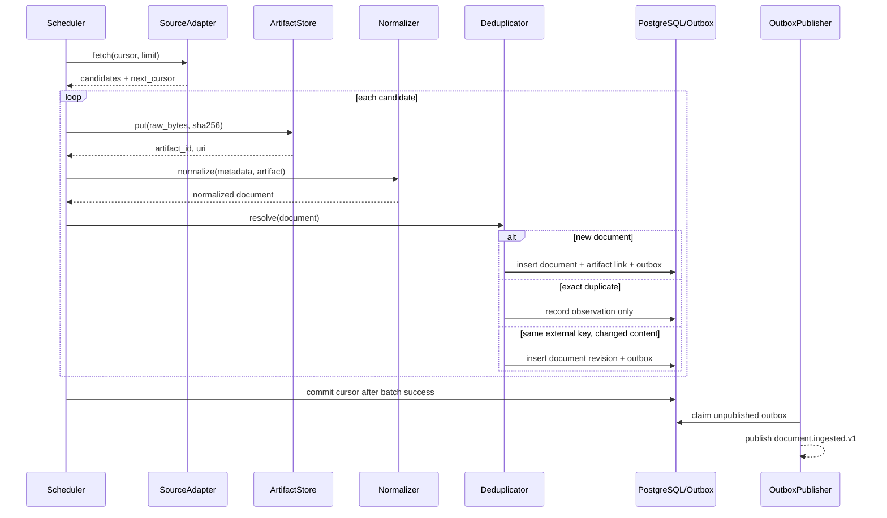

# DD-10 数据接入详细设计

## 1. 目标与边界

数据接入域负责从已配置来源取得公告，保存不可变原件，生成标准化文档，并可靠发布 `document.ingested.v1`。它不负责判断金融事件、映射证券实体或生成研究结论。

覆盖：FR-001、AC-001、NFR-003、NFR-004、NFR-006。

## 2. 内部组件

| 组件 | 职责 | 禁止事项 |
| --- | --- | --- |
| SourceRegistry | 来源配置、可信等级、抓取游标和健康状态 | 不保存采集正文 |
| CollectorScheduler | 创建采集批次并控制并发、限流 | 不解析金融语义 |
| SourceAdapter | 调用单一来源并返回统一候选项 | 不直接写业务表 |
| ArtifactStore | 保存原始字节、Hash、MIME 和对象存储 URI | 不覆盖同 Hash 对象 |
| DocumentNormalizer | 统一标题、正文、时间、URL 和附件元数据 | 不修改原始 Artifact |
| ExactDeduplicator | 根据来源键和内容 Hash 判断精确重复 | 不做事件级语义合并 |
| IngestionService | 事务写入 Document、关系和 outbox | 不直接投递消息 |

## 3. 主时序



游标只在批次内所有候选项得到“创建、重复或明确失败”结果后推进。单条永久失败进入隔离队列，不阻塞整个来源。

## 4. 来源适配器契约

```python
class SourceAdapter(Protocol):
    async def fetch(
        self,
        cursor: str | None,
        limit: int,
    ) -> FetchResult: ...
```

`FetchResult` 包含 `items`、`next_cursor`、`has_more` 和来源响应时间。候选项至少包含 `external_id` 或 URL、标题、发布时间、详情获取入口和原始响应元数据。

适配器错误分类：

| 错误 | 重试 | 处理 |
| --- | --- | --- |
| `SOURCE_RATE_LIMITED` | 是 | 使用响应头或退避时间，降低并发 |
| `SOURCE_TIMEOUT` | 是 | 最多 3 次指数退避 |
| `SOURCE_AUTH_FAILED` | 否 | 暂停来源并告警 |
| `SOURCE_SCHEMA_CHANGED` | 否 | 隔离样本并告警适配器维护人 |
| `CONTENT_UNAVAILABLE` | 有条件 | 记录观察，稍后补偿获取 |

## 5. 标准化规则

- URL：移除已知跟踪参数，保留会改变内容的查询参数。
- 标题：Unicode NFKC、合并连续空白；原始标题另存。
- 正文：保留段落顺序；表格转结构化块，不拼成不可定位文本。
- 时间：保留来源原始字符串和解析后时间；无法确认时区则标记 `time_quality=uncertain`。
- 附件：逐个保存 Artifact，并记录文件名、MIME、Hash 和父文档关系。
- 编码：解析失败不得用替换字符静默吞错，进入隔离队列。

## 6. 去重与修订

按顺序执行：

1. `(source_id, external_id)` 唯一键命中且内容 Hash 相同：重复观察。
2. 唯一键命中但内容 Hash 不同：创建 DocumentRevision，不覆盖旧内容。
3. 唯一键未命中但规范化 URL 命中：按内容 Hash 判断重复或修订。
4. 内容 Hash 全局命中：创建新的来源观察关系，不重复保存字节。
5. 均未命中：创建新 Document。

近似转载与事件合并属于事件中心，不在本模块处理。

## 7. 内部接口

`POST /internal/v1/documents/ingest` 用于受信采集器提交单个文档，不面向普通用户。

请求关键字段：`source_id`、`external_id`、`url`、`published_at_raw`、`title_raw`、`artifact_id`、`metadata`。

返回状态：`created`、`duplicate` 或 `revised`，以及 `document_id`、`revision_id`、`content_hash`。接口遵循 DD-00 的幂等约定。

## 8. 运行控制

- 每个来源独立并发和速率限制，默认并发 1。
- 批次默认 100 条，可按来源配置但受全局上限约束。
- 原始 Artifact 上传成功、数据库写入失败时由孤儿清理任务延迟回收。
- 来源连续 5 个批次失败进入 `degraded`，认证或 Schema 错误直接进入 `paused`。
- 对象存储不可用时停止新采集，不创建缺少原件的 Document。

## 9. 可观测指标

- `ingestion_items_total{source,result}`
- `ingestion_lag_seconds{source}`
- `source_request_duration_seconds{source}`
- `source_batch_failures_total{source,error_code}`
- `artifact_store_bytes_total{mime}`
- `document_duplicates_total{source}`
- `ingestion_quarantine_size{source}`

## 10. 测试设计

- 同一批次重复、跨批次重复和相同 external ID 内容变化。
- 原件上传成功但事务回滚；事务成功但消息发布失败。
- 来源分页中途超时后恢复，不跳项也不重复产生 Document。
- HTML、PDF、乱码、缺少时区和附件下载失败。
- Schema 变化、限流、认证失效及来源暂停。
- 日志和错误响应不泄漏正文或认证信息。

## 11. 待确认事项

- 首个官方来源及其抓取协议、授权和频率限制。
- 原始 Artifact 的保留期限、加密和对象锁策略。
- 修订公告是同一 Document 的 Revision，还是独立 Document 加关系；当前基线采用 Revision。

