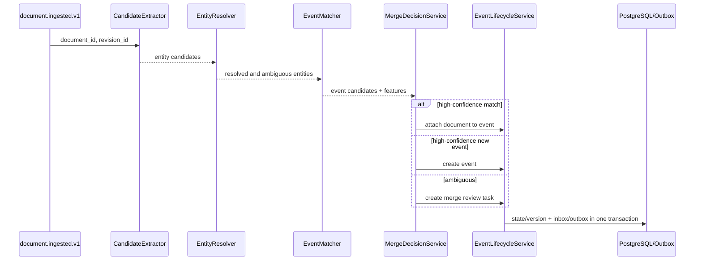

# DD-20 事件中心详细设计

## 1. 目标与边界

事件中心把标准化文档转化为稳定、可合并、可审计的金融事件，并完成证券实体对齐。它拥有 Event 生命周期；不拥有原始文档、事实验证状态或研究报告。

覆盖：FR-002、FR-003、AC-002～AC-004、NFR-003。

## 2. 内部组件

| 组件 | 职责 |
| --- | --- |
| CandidateExtractor | 用确定性规则抽取代码、公司名、公告类型和时间候选 |
| EntityResolver | 将候选映射到稳定 Entity/Security ID |
| EventClassifier | 在五类 MVP 类型中分类并输出置信度 |
| EventMatcher | 检索可能属于同一事件的候选 Event |
| MergeDecisionService | 规则优先、模型补充地决定新建、合并或待审核 |
| EventLifecycleService | 执行状态迁移、版本更新和关联文档 |
| TriageService | 计算重要度、紧急度和研究路由输入 |

## 3. 消费时序



消费使用消息 ID 写 inbox 去重。文档修订会重新计算分类和匹配，但不得静默移动已经发布报告所关联的事件。

## 4. MVP 事件类型

| 枚举 | 识别重点 | 关键字段 |
| --- | --- | --- |
| `earnings_guidance` | 预计业绩范围、同比方向、期间 | period、profit_metric、range、change_rate |
| `major_contract` | 合同主体、金额、期限、占比 | counterparties、amount、currency、duration |
| `merger_acquisition` | 标的、交易方式、阶段、金额 | target、transaction_type、stage、valuation |
| `shareholder_reduction` | 股东、计划/完成、数量和比例 | shareholder、stage、shares、ownership_ratio |
| `regulatory_penalty` | 监管主体、对象、原因和处罚 | authority、subject、reason、penalty |

无法归类到五类时标记 `unsupported` 并归档，不强制选择最接近类型。

## 5. 实体对齐

### 5.1 候选生成

按证券代码精确匹配、公司全称/简称词典、历史名称和公告来源主体生成候选。候选记录匹配字段和文本位置。

### 5.2 候选排序

建议初始分值：代码精确匹配 1.0；来源主体匹配 0.95；全称匹配 0.90；简称匹配 0.75。分值是可配置规则结果，不等同于模型置信度。

### 5.3 决策阈值

- 唯一候选 `>= 0.90`：自动对齐。
- 第一候选 `< 0.90` 或前两名差值 `< 0.10`：进入人工审核。
- 无候选：保留文本候选并标记 unresolved，不创建临时公司主数据。

最终阈值须用标注集校准，以 AC-004 的准确率要求为准。

## 6. 事件匹配

### 6.1 候选召回

仅在以下窗口检索：至少一个主要实体相同、事件类型相同或兼容、发布时间位于类型配置窗口内。MVP 默认窗口为 30 天，并购重组可放宽到 180 天。

### 6.2 匹配特征

```text
match_score =
    0.35 * entity_overlap
  + 0.25 * type_compatibility
  + 0.20 * key_field_similarity
  + 0.10 * time_proximity
  + 0.10 * title_similarity
```

这只是初始基线。关键字段冲突可直接否决合并，例如不同合同对手方或不同业绩期间。

### 6.3 决策

- `score >= 0.85` 且无否决条件：自动合并。
- `score < 0.55`：新建事件。
- 中间区间或存在冲突：创建 MergeReviewTask。

保存候选集、特征、分数、规则版本和最终决定，便于评估误合并与漏合并。

## 7. 事件状态

事件中心允许的早期迁移：

```text
ingested -> triaged -> researching
                   -> archived
triaged  -> needs_review
needs_review -> triaged | archived
```

后续研究状态由工作流请求、事件中心校验后迁移。每次迁移要求 `expected_version`，并写 EventStateHistory。

## 8. 重要度与紧急度

MVP 先采用可解释规则分作为 Router 的输入：来源等级、事件类型基线、金额/业绩变化相对公司规模、监管严重度和时效性。Router 可以调整分值，但必须返回理由和模型版本。

重要度范围 `[0, 1]`；紧急度为 `low | normal | high | critical`。低重要度归档阈值配置化，不写死在提示词中。

## 9. 接口与事件

内部查询：

- `GET /internal/v1/events/candidates?entity_id=&type=&from=`：供匹配服务召回。
- `POST /internal/v1/events/{id}/transitions`：带 expected version 的状态迁移。
- `POST /internal/v1/merge-reviews/{id}/decision`：提交合并、新建或忽略决定。

输出事件：

- `event.created.v1`
- `event.document_attached.v1`
- `event.updated.v1`
- `event.merge_review_requested.v1`
- `event.triaged.v1`

## 10. 失败与恢复

- 分类或实体模型不可用：使用规则结果；不足以决策时进入审核，不阻塞消息队列。
- 同一文档并发处理：DocumentEvent 唯一键保证只关联一次。
- Event 版本冲突：重新读取并最多重算一次；再次冲突则延迟重试。
- 错误合并：不得删除历史，通过拆分操作创建新 Event、迁移未发布关联并记录审计；已发布报告保留原关联并标记纠正关系。

## 11. 测试设计

- 五类事件的正例、边界例和 `unsupported` 例。
- 证券代码、全称、简称、历史名称和同名公司歧义。
- 同公告转载、公告修订、同公司同日多个合同和跨期业绩预告。
- 匹配阈值边界、关键字段否决和人工合并决定。
- 重复消息、并发状态迁移、版本冲突和拆分纠错。
- 分类降级时不产生虚假的高置信度事件。

## 12. 待确认事项

- 五类事件的字段 Schema 与各类公告标注规范。
- 重要度规则中的公司规模基准来自哪个财务数据源。
- 并购事件窗口及阶段变更应作为同一 Event 更新还是子事件；当前基线采用同一 Event 的阶段更新。

