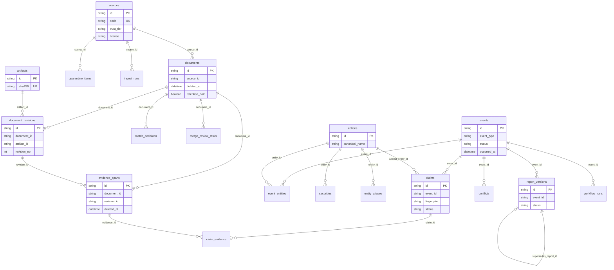
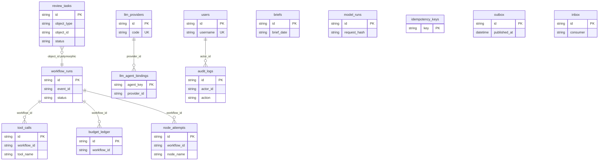

# DD-30 MVP 物理数据模型

## 1. 范围与约定

本文细化数据接入和事件中心的 PostgreSQL 物理模型。逻辑语义以[核心数据模型](../02-data-model.md)为准。表名使用复数 `snake_case`，主键为 UUIDv7，所有可更新表包含 `created_at`、`updated_at` 和整数 `version`。

## 2. Schema 划分

MVP 使用一个 PostgreSQL 实例，按功能域划分 Schema：

- `ingestion`：来源、批次、原件、文档和修订。
- `events`：实体、证券、事件、关联和审核任务。
- `evidence`：证据定位、事实声明、支持关系和冲突。
- `research`：工作流、节点、Blackboard、Agent、工具和分析结果。
- `platform`：outbox、inbox、幂等记录和审计日志。

模块数据库账号只拥有自身 Schema 写权限；跨域读取优先通过应用接口，必要的只读视图显式授权。

## 3. 数据接入表

### 3.1 `ingestion.sources`

| 字段 | 类型 | 约束 |
| --- | --- | --- |
| id | uuid | PK |
| code | varchar(64) | UNIQUE，稳定来源代码 |
| name | varchar(200) | NOT NULL |
| source_type | varchar(32) | CHECK 枚举 |
| trust_tier | char(1) | CHECK S/A/B/C |
| status | varchar(16) | active/degraded/paused |
| config_ref | varchar(200) | 非密钥配置引用 |
| cursor | text | 可空 |
| last_success_at | timestamptz | 可空 |
| version | integer | NOT NULL |

### 3.2 `ingestion.artifacts`

| 字段 | 类型 | 约束 |
| --- | --- | --- |
| id | uuid | PK |
| sha256 | char(64) | UNIQUE, NOT NULL |
| storage_uri | text | UNIQUE, NOT NULL |
| mime_type | varchar(100) | NOT NULL |
| byte_size | bigint | CHECK >= 0 |
| encryption_key_ref | varchar(200) | 可空 |
| created_at | timestamptz | NOT NULL |

Artifact 不更新原始字节；元数据纠错另写审计。

### 3.3 `ingestion.documents`

| 字段 | 类型 | 约束 |
| --- | --- | --- |
| id | uuid | PK |
| source_id | uuid | FK sources |
| external_id | varchar(300) | 可空 |
| canonical_url | text | 可空 |
| title | text | NOT NULL |
| published_at | timestamptz | 可空 |
| published_at_raw | text | 可空 |
| ingested_at | timestamptz | NOT NULL |
| current_revision_id | uuid | 延迟 FK revisions |
| status | varchar(16) | active/quarantined/withdrawn |
| version | integer | NOT NULL |

部分唯一索引：`(source_id, external_id) WHERE external_id IS NOT NULL`。规范化 URL 建普通索引，不假设全球唯一。

### 3.4 `ingestion.document_revisions`

| 字段 | 类型 | 约束 |
| --- | --- | --- |
| id | uuid | PK |
| document_id | uuid | FK documents |
| revision_no | integer | UNIQUE(document_id, revision_no) |
| artifact_id | uuid | FK artifacts |
| content_hash | char(64) | NOT NULL |
| normalized_content_uri | text | NOT NULL |
| parser_version | varchar(50) | NOT NULL |
| metadata | jsonb | NOT NULL DEFAULT `{}` |
| created_at | timestamptz | NOT NULL |

`(document_id, content_hash)` 唯一，避免相同内容形成重复修订。

### 3.5 辅助表

- `ingestion.collection_batches`：来源、游标起止、状态、计数和错误摘要。
- `ingestion.source_observations`：每次观察到 external ID/URL/Hash 的记录。
- `ingestion.quarantine_items`：原始引用、错误码、重试次数和处置状态。

## 4. 事件中心表

### 4.1 `events.entities` 与 `events.securities`

`entities` 保存稳定主体：`id`、`entity_type`、`canonical_name`、`status`、`valid_from`、`valid_to`。

`securities` 保存证券标识：`id`、`entity_id`、`ticker`、`exchange`、`market_code`、`valid_from`、`valid_to`，其中 `(market_code, valid_from)` 唯一。

名称、简称和历史名称存入 `events.entity_aliases`，包含 alias、类型、语言、有效期和来源。

### 4.2 `events.events`

| 字段 | 类型 | 约束 |
| --- | --- | --- |
| id | uuid | PK |
| event_type | varchar(40) | 五类枚举、`general_market_news`、`out_of_scope`（历史 `unsupported`） |
| status | varchar(24) | 状态机约束 |
| occurred_at | timestamptz | 可空 |
| importance | numeric(4,3) | CHECK 0..1 |
| urgency | varchar(16) | CHECK 枚举 |
| title | text | NOT NULL |
| key_fields | jsonb | 按版本化 Schema 校验 |
| classifier_version | varchar(50) | NOT NULL |
| as_of | timestamptz | NOT NULL |
| version | integer | NOT NULL |

索引：`(status, importance DESC, id DESC)`、`(event_type, occurred_at DESC)`。`key_fields` 只保存类型差异字段，频繁查询字段应提升为列或关联表。

### 4.3 关系与历史

- `events.event_documents(event_id, document_id, revision_id, relation_type, attached_at)`，唯一 `(event_id, document_id, revision_id)`。
- `events.event_entities(event_id, entity_id, role, confidence, resolution_method)`。
- `events.event_state_history(event_id, from_status, to_status, reason, actor_type, actor_id, created_at)`。
- `events.match_decisions(document_id, candidate_event_id, feature_set, score, rule_version, decision, created_at)`。
- `events.merge_review_tasks(id, document_id, candidates, status, decision, reviewer_id, decided_at)`。

## 5. 证据中心表

### 5.1 `evidence.evidence_spans`

| 字段 | 类型 | 约束 |
| --- | --- | --- |
| id | uuid | PK |
| document_id | uuid | NOT NULL，逻辑引用 ingestion.documents |
| revision_id | uuid | NOT NULL，逻辑引用 ingestion.document_revisions |
| locator_type | varchar(16) | pdf/html/table |
| locator | jsonb | 按版本化 Locator Schema 校验 |
| excerpt | text | NOT NULL |
| excerpt_hash | char(64) | NOT NULL |
| extraction_method | varchar(32) | parser/agent/human |
| extraction_version | varchar(50) | NOT NULL |
| created_at | timestamptz | NOT NULL |

唯一键为 `(revision_id, excerpt_hash, locator)`。Locator 必须绑定不可变 Revision，不得只引用当前文档版本。

### 5.2 `evidence.claims`

| 字段 | 类型 | 约束 |
| --- | --- | --- |
| id | uuid | PK |
| event_id | uuid | NOT NULL，逻辑引用 events.events |
| subject_entity_id | uuid | 可空，无法对齐时使用 subject_text |
| subject_text | text | NOT NULL |
| predicate | varchar(80) | 受控词表 |
| object_value | jsonb | 带类型的值对象 |
| qualifiers | jsonb | 期间、口径、条件等限定 |
| fingerprint | char(64) | NOT NULL |
| status | varchar(16) | unverified/verified/conflicted/rejected |
| confidence | numeric(4,3) | CHECK 0..1 |
| as_of | timestamptz | NOT NULL |
| policy_version | varchar(50) | NOT NULL |
| version | integer | NOT NULL |

唯一键 `(event_id, fingerprint, as_of)` 防止单次核验重复创建同义事实。事实发生变化时创建新 Claim 并建立替代关系，不改写 `object_value`。

### 5.3 关系、冲突与历史

- `evidence.claim_evidence(claim_id, evidence_id, stance, source_independence_key, weight)`，`stance` 为 support/refute/context。
- `evidence.claim_relations(from_claim_id, to_claim_id, relation_type)`，支持 supersedes/duplicates/qualifies。
- `evidence.claim_status_history(claim_id, from_status, to_status, reason_code, actor_type, actor_id, created_at)`。
- `evidence.conflicts(id, event_id, conflict_type, severity, status, summary, resolution, version)`。
- `evidence.conflict_claims(conflict_id, claim_id, role)`。

### 5.4 数据库边界

PostgreSQL 不支持跨 Schema 独立部署后的外键，因此跨功能域引用在 MVP 中使用逻辑外键，由应用服务验证并由一致性任务巡检；同一 Schema 内保留真实外键。若所有模块共享迁移周期，可在 MVP 临时使用跨 Schema 外键，但不得让领域代码依赖级联删除。

## 6. 研究工作流表

### 6.1 `research.workflow_runs`

| 字段 | 类型 | 约束 |
| --- | --- | --- |
| id | uuid | PK |
| event_id | uuid | NOT NULL，逻辑引用 events.events |
| trigger_id | uuid | NOT NULL |
| workflow_version | varchar(50) | NOT NULL |
| status | varchar(24) | 工作流状态机约束 |
| budget_profile | varchar(50) | NOT NULL |
| as_of | timestamptz | NOT NULL |
| started_at | timestamptz | 可空 |
| ended_at | timestamptz | 可空 |
| current_node | varchar(80) | 可空 |
| graph_checkpoint_ref | text | 可空 |
| version | integer | NOT NULL |

唯一键 `(event_id, trigger_id, workflow_version)`。同一 Event 只允许一个 `pending/running/waiting_review/paused` 主写运行，使用部分唯一索引实现。

### 6.2 `research.node_attempts`

| 字段 | 类型 | 约束 |
| --- | --- | --- |
| id | uuid | PK |
| workflow_id | uuid | FK workflow_runs |
| node_name | varchar(80) | NOT NULL |
| attempt_no | integer | NOT NULL |
| input_hash | char(64) | NOT NULL |
| status | varchar(24) | 节点状态枚举 |
| output_schema_version | varchar(50) | 可空 |
| output_ref | text | 可空 |
| output_hash | char(64) | 可空 |
| error_code | varchar(80) | 可空 |
| started_at | timestamptz | 可空 |
| ended_at | timestamptz | 可空 |

唯一键 `(workflow_id, node_name, attempt_no)`；对成功结果建立 `(workflow_id, node_name, input_hash)` 查询索引以支持幂等复用。

### 6.3 `research.blackboard_versions`

字段：`id`、`workflow_id`、`state_version`、`changed_field`、`owner_node`、`value_ref`、`value_hash`、`schema_version`、`node_attempt_id`、`created_at`。唯一键 `(workflow_id, state_version)`。

每行表示一次字段提交；当前 Blackboard 通过各字段最新版本投影获得。不得更新旧版本内容。

### 6.4 `research.agent_runs`

字段：`id`、`node_attempt_id`、`agent_type`、`model_provider`、`model_name`、`model_version`、`prompt_version`、`input_ref`、`input_hash`、`output_ref`、`output_hash`、`schema_version`、`token_usage`、`cost_minor_units`、`status`、`trace_id`、`started_at`、`ended_at`。

提示词和输入输出正文默认放对象存储，表内保存引用及 Hash。

### 6.5 `research.tool_calls`

字段：`id`、`agent_run_id`、`tool_name`、`tool_version`、`arguments_hash`、`result_ref`、`result_hash`、`as_of`、`status`、`error_code`、`duration_ms`、`started_at`、`ended_at`。工具参数正文按敏感级别保存，不直接进入普通日志。

### 6.6 `research.analyses`

字段：`id`、`event_id`、`workflow_id`、`analysis_type`、`status`、`payload_ref`、`payload_hash`、`schema_version`、`confidence`、`as_of`、`supersedes_id`、`created_at`。`analysis_type` 为 company/skeptic/synthesis/guardrail。

### 6.7 `research.review_tasks`

字段：`id`、`workflow_id`、`object_type`、`object_id`、`reason_code`、`resume_from`、`blackboard_version`、`allowed_decisions`、`status`、`decision`、`reviewer_id`、`comment`、`created_at`、`decided_at`、`version`。

### 6.8 `research.budget_ledger`

字段：`id`、`workflow_id`、`node_attempt_id`、`dimension`、`entry_type`、`amount`、`unit`、`created_at`。`entry_type` 为 reserve/settle/release/adjust；余额通过账本汇总，不就地覆盖消费量。

## 7. 平台一致性表

### 7.1 `platform.outbox`

字段：`id`、`event_type`、`aggregate_id`、`payload`、`trace_id`、`created_at`、`published_at`、`attempts`、`next_attempt_at`。未发布索引使用 `WHERE published_at IS NULL`。

### 7.2 `platform.inbox`

字段：`consumer`、`message_id`、`received_at`、`processed_at`、`result`，主键 `(consumer, message_id)`。

### 7.3 `platform.idempotency_keys`

字段：`scope`、`key`、`request_hash`、`response_status`、`response_body`、`expires_at`，主键 `(scope, key)`。

## 8. 事务边界

- 新建文档：Document、Revision、Observation 和 outbox 同事务。
- 更新采集游标：只在批次完成事务中更新 Source cursor 和 Batch 状态。
- 新建事件：Event、EventDocument、EventEntity、StateHistory、inbox 和 outbox 同事务。
- 人工合并决定：ReviewTask、关系变更、MatchDecision、审计和 outbox 同事务。
- 提交事实核验：EvidenceSpan、Claim、ClaimEvidence、Conflict、状态历史和 outbox 同事务。
- 提交节点结果：NodeAttempt、BlackboardVersion、Analysis、预算结算和 outbox 同事务。
- 创建审核任务：WorkflowRun 状态、ReviewTask、检查点引用和 outbox 同事务。
- 恢复工作流：ReviewTask 决定、WorkflowRun 版本、预算调整和 outbox 同事务。
- Artifact 对象存储不参与数据库事务，通过内容寻址和孤儿回收保证最终一致。

## 9. 迁移与保留

- 使用单向、可重复部署的版本化迁移；破坏性变更采用 expand-migrate-contract。
- outbox/inbox 和幂等记录按运维策略分区及清理，但清理不得破坏审计链。
- Document、Revision、Event、状态历史和匹配决定默认长期保留。
- JSONB Schema 版本写入 payload 或显式列；迁移不得假设历史 JSON 已自动升级。
- WorkflowRun、NodeAttempt、AgentRun、ToolCall 和 Analysis 长期保留；大型正文按许可和审计策略分层存储。

## 10. 数据库测试

- 唯一约束、部分索引和外键的并发测试。
- 乐观锁版本冲突和事务回滚测试。
- outbox 发布失败、重复发布和 inbox 去重测试。
- 查询计划验证：事件列表、文档去重、候选事件召回。
- 迁移前向兼容、回滚方案及历史 JSON 读取测试。
- Claim 指纹去重、Evidence Locator 唯一性和来源独立性约束测试。
- 单 Event 主写运行唯一性、Blackboard 版本冲突和预算账本守恒测试。
- NodeAttempt 提交时 Analysis、预算与 outbox 的原子性测试。

## 11. 待确认事项

- UUIDv7 由应用生成还是采用 PostgreSQL 扩展；当前建议由应用统一生成。
- 规范化正文首期存对象存储还是 PostgreSQL；当前建议对象存储，数据库保留检索摘要。
- 是否需要对来源和事件表做租户隔离；内部单团队 MVP 暂不引入 tenant_id。

## 12. 跨域引用与无物理 FK 清单（IMP-010）

### 12.1 策略结论（对照当前 ORM / Alembic）

- 当前实现中 **ORM 未声明任何 `ForeignKey`**（物理 FK 数 = 0）。跨表、跨 schema 引用一律为**逻辑外键**：列存目标 ID，由 Repository / 服务层校验；删除/保留规则由应用执行（见 Document 软删/`purge`），**不依赖数据库级联**。
- DD-30 §5.4 原述「同 Schema 内保留真实外键」在 MVP 实现中尚未落地；后续若补物理 FK，应优先同一 schema 内边（如 `document_revisions.document_id → documents`），跨 schema 边保持逻辑引用，避免阻碍 schema 拆分。
- 数组型引用（`events.document_ids`、`events.entity_ids`、`claims.evidence_ids`）同样无物理 FK；一致性靠写入路径与巡检。

### 12.2 跨功能域逻辑引用（优先巡检）

| 引用列 | 逻辑目标 | 删除/保留备注 |
| --- | --- | --- |
| `evidence.evidence_spans.document_id` | `ingestion.documents` | 文档 soft-delete 隐藏读；purge 物理删证据行 |
| `evidence.evidence_spans.revision_id` | `ingestion.document_revisions` | 修订不可变；purge 不删 revision 行（MVP） |
| `evidence.claims.event_id` | `events.events` | 事件不可因文档 purge 级联删 |
| `evidence.claims.subject_entity_id` | `events.entities` | 可空 |
| `evidence.conflicts.event_id` | `events.events` | 冲突随事件保留 |
| `platform.workflow_runs.event_id` | `events.events` | 工作流审计长期保留 |
| `publishing.report_versions.event_id` | `events.events` | 报告版本不可级联删 |
| `publishing.report_versions.supersedes_report_id` | `publishing.report_versions` | 同域逻辑链 |
| `platform.review_tasks.object_id` | 多态（workflow/report 等） | 按 `object_type` 解释 |
| `platform.audit_logs.object_id` / `actor_id` | 多态 / `platform.users` | 审计永不级联删 |
| `platform.llm_agent_bindings.provider_id` | `platform.llm_providers` | 同域逻辑引用 |
| `events.match_decisions.document_id` | `ingestion.documents` | 匹配历史长期保留 |
| `events.merge_review_tasks.document_id` | `ingestion.documents` | 审核任务保留 |

### 12.3 同域逻辑引用（当前亦无物理 FK）

| 引用列 | 逻辑目标 |
| --- | --- |
| `ingestion.documents.source_id` | `ingestion.sources` |
| `ingestion.document_revisions.document_id` | `ingestion.documents` |
| `ingestion.document_revisions.artifact_id` | `ingestion.artifacts` |
| `ingestion.ingest_runs.source_id` / `quarantine_items.source_id` | `ingestion.sources` |
| `events.securities.entity_id` / `entity_aliases.entity_id` | `events.entities` |
| `events.event_entities.*` | `events.events` / `events.entities` |
| `evidence.claim_evidence.*` | `evidence.claims` / `evidence.evidence_spans` |
| `platform.tool_calls.workflow_id` / `budget_ledger.workflow_id` / `node_attempts.workflow_id` | `platform.workflow_runs` |

### 12.4 后续工作（本切片不改 DDL）

1. 可选：为同 schema 边补物理 FK（无 `ON DELETE CASCADE`）。
2. 只读孤儿巡检：`uv run python scripts/orphan_audit.py`（`--fail-on-findings` 可选）；实现见 `app/platform/orphan_audit.py`。CI（`.github/workflows/ci.yml`）在 pytest 后以 `FINSIGHT_REPOSITORY=memory` 跑空库绿路径并 `--fail-on-findings`。
3. 关键列表查询计划评审见 §13；ER 图见 §14；可选同 schema 物理 FK 仍属 IMP-010 未关闭项。

## 13. 关键列表查询计划评审（IMP-010）

评审日：2026-07-23。对象：Admin/API 高频游标列表；对照 `SqlAlchemyRepository` SQL 与现有索引。结论以「是否支持 keyset 分页避免 OFFSET」为主；未跑生产 `EXPLAIN ANALYZE`（无规模数据）。

### 13.1 `GET /api/v1/events` → `list_events`

| 项 | 现状 |
| --- | --- |
| 排序 / 游标 | `ORDER BY occurred_at DESC, id DESC`；`_cursor_filter(occurred_at, id)` keyset |
| 可选谓词 | `as_of` → `occurred_at <= as_of` |
| 既有索引 | `ix_event_status_importance (status, importance)`：**不服务**本列表 |
| 缺口与处置 | 缺 `(occurred_at, id)`；迁移 `20260723_0016` + ORM `ix_events_occurred_at_id` 已补齐 |

期望计划形态：Index Range Scan / Backward Index Scan on `ix_events_occurred_at_id`，`LIMIT` 截断；避免按 `importance` 索引再排序。

### 13.2 `GET /api/v1/sources` → `list_sources`

| 项 | 现状 |
| --- | --- |
| 排序 / 游标 | `ORDER BY id DESC`；游标取 `id`（API 侧时间戳占位，SQL 仅比较 `id < cursor_id`） |
| 既有索引 | 主键 `id` |
| 结论 | **MVP 可接受**：来源行数通常远小于事件；PK 反向扫描即可。暂不新增索引。 |

备注：若未来按 `status`/`next_retry_at` 调度列表化，再评估 `(status, next_retry_at, id)`；worker 调度路径不走本 API。

### 13.3 旁路已对齐（本切片不改）

| 路径 | 索引 |
| --- | --- |
| `list_ingest_runs(source_id)` | `ix_ingest_runs_source_started (source_id, started_at)` |
| `list_review_tasks(status)` | `ix_review_tasks_status_created (status, created_at)` |

### 13.4 残余

- 生产库对 §13.1 做一次 `EXPLAIN (ANALYZE, BUFFERS)` 复核。
- 可选同 schema 物理 FK 另排期。

## 14. MVP ER 图（对照当前 ORM，IMP-010）

绘制日：2026-07-23。范围：`app/platform/db_models.py` 当前 **32** 张表（含 schema 前缀）。边均为**逻辑引用**（无物理 `ForeignKey`）；虚线语义见 §12。未实现的设计表（如 `collection_batches`、`event_documents`）不画入。

### 14.1 接入 → 事件 → 证据 → 发布

说明：`events.document_ids` / `events.entity_ids` 为数组型逻辑引用，图中以 `event_entities` 与文档侧匹配表表达主关系；数组列不单独画边。

### 14.2 研究运行时与平台

### 14.3 读图约定

| 约定 | 含义 |
| --- | --- |
| 实线边 | 应用层逻辑外键（Repository / 服务校验）；**非** DDL `FOREIGN KEY` |
| Schema | 表归属见 §2；跨 schema 边不阻碍未来拆库 |
| 巡检 | 断裂引用由 `orphan_audit` 发现（§12.4） |
| 残余 | 可选同 schema 物理 FK（无 `ON DELETE CASCADE`）另排期 |
