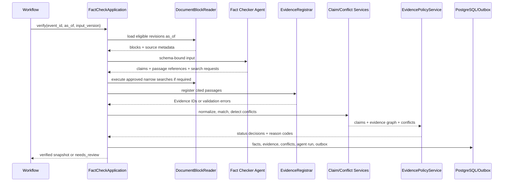
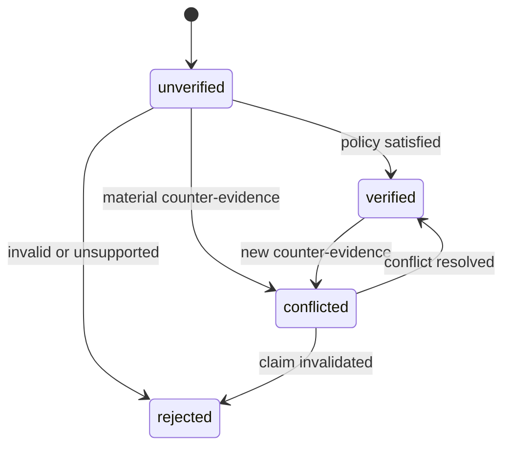

# DD-40 证据中心详细设计

## 1. 目标与边界

证据中心将事件相关文档转化为可定位的原始证据和结构化事实，执行来源政策、发现事实冲突，并为后续分析提供只读的已验证事实快照。

覆盖：FR-004、AC-005、AC-011、NFR-003、NFR-005、NFR-006。

证据中心不判断利好或利空，不计算财务影响，不发布研究报告。Fact Checker 负责提出候选事实和证据关系；确定性的 EvidencePolicyService 决定事实状态。

## 2. 核心组件

| 组件 | 职责 | 输出 |
| --- | --- | --- |
| DocumentBlockReader | 按 Revision 读取带稳定位置的文本、表格和页面块 | DocumentBlock |
| EvidenceRegistrar | 校验证据位置、原文一致性并生成 Evidence ID | EvidenceSpan |
| ClaimNormalizer | 规范主体、谓词、值、单位、期间和口径 | NormalizedClaim |
| ClaimMatcher | 计算事实指纹，识别重复、补充或替代事实 | ClaimMatch |
| ConflictDetector | 比较主体、数值、期间和语义，生成冲突组 | Conflict |
| EvidencePolicyService | 按来源等级、独立性和冲突决定事实状态 | ClaimDecision |
| FactCheckApplication | 编排模型、工具、事务和领域事件 | FactCheckResult |

## 3. 核验主时序



所有检索结果必须先进入 Document/Revision，再生成 Evidence；Agent 返回的 URL 或自由文本不能直接成为最终证据。

## 4. 原文定位模型

Evidence 绑定不可变 `revision_id`、抽取器版本、原文片段和片段 Hash。定位统一使用 1-based 页码、0-based 字符偏移。

### 4.1 PDF

```json
{
  "type": "pdf",
  "page": 12,
  "block_id": "p12-b07",
  "char_start": 18,
  "char_end": 64,
  "bbox": [0.08, 0.34, 0.91, 0.41]
}
```

`bbox` 使用页面归一化坐标 `[x1,y1,x2,y2]`。文字层缺失时允许 OCR，但必须记录 `extraction_method=ocr` 和 OCR 版本。

### 4.2 HTML

```json
{
  "type": "html",
  "block_id": "main-p-023",
  "char_start": 0,
  "char_end": 48,
  "dom_path": "main/article/p[23]"
}
```

`dom_path` 仅辅助展示，稳定锚点是快照 Revision、block ID 和偏移。

### 4.3 表格

```json
{
  "type": "table",
  "block_id": "p08-t02",
  "row_start": 4,
  "row_end": 5,
  "column_start": 2,
  "column_end": 4
}
```

表头、单位和脚注必须与数值单元格一起引用，防止脱离会计口径。

## 5. 事实模型

Claim 使用“主体—谓词—值—限定条件”表达：

```json
{
  "subject": {"entity_id": "ent_019...", "text": "示例公司"},
  "predicate": "expects_net_profit",
  "object": {
    "type": "range",
    "min": "160000000.00",
    "max": "190000000.00",
    "unit": "CNY"
  },
  "qualifiers": {
    "period": "2026-H1",
    "accounting_scope": "attributable_to_parent",
    "comparison": "year_over_year"
  }
}
```

数字以字符串十进制传输。谓词使用版本化受控词表；未知谓词可提交候选，但进入 `unverified`，不得临时拼写新谓词绕过校验。

事实指纹由规范化主体、谓词、值、单位、期间和关键限定条件生成。原文措辞、置信度和 Evidence ID 不参与指纹。

## 6. 来源独立性

多个页面不等于多个独立来源。`source_independence_key` 按以下优先级生成：

1. 原始监管文件或交易所公告 ID。
2. 公司披露 ID。
3. 有独立采编标记的媒体组织与稿件 ID。
4. 无法确认时使用传播链根文档；转载共享同一 key。

Agent 可以提出来源关系，最终由规则和来源元数据确定。引用十篇相互转载的新闻仍只计一个来源。

## 7. 验证政策

### 7.1 决策规则

| 条件 | 结果 |
| --- | --- |
| 至少一个 S 级直接证据，且无关键反证 | `verified` |
| 至少一个 A 级直接证据加一个独立 A/B 级支持证据 | `verified` |
| 只有 B/C 级来源 | `unverified` |
| 存在同主体、谓词、期间但关键值不兼容的有效证据 | `conflicted` |
| 原文不支持、主体错误、期间错误或引用失效 | `rejected` |

公司公告对“公司披露了什么”可作为 S 级事实；对第三方行为或未来结果不自动视为已证实。例如“公司称已签订合同”与“合同一定履约”是不同 Claim。

### 7.2 置信度

置信度用于表达证据质量，不替代状态规则。初始分数由来源等级、直接性、独立来源数量、定位质量、冲突和时效性计算，范围 `[0,1]`。Policy Service 保存分项和规则版本，禁止 Agent 单独决定最终分数。

### 7.3 关键事实

关键事实包括报告摘要中的数字、主体、监管结论及驱动方向判断的事实。关键事实必须为 `verified`；`conflicted` 只能进入冲突说明，`unverified` 只能进入待验证事项。

## 8. 冲突识别与解决

冲突类型：`value`、`unit`、`period`、`subject`、`time`、`scope`、`semantic`。

严重度：

- `critical`：改变事件主体、类型、核心金额或监管结论，必须人工审核。
- `major`：影响核心事实但可能由口径解释，阻止完整研究报告。
- `minor`：不改变主要结论，可保留说明后继续。

自动解决只允许单位换算、明确的期间格式统一和已发布修订对旧版本的替代。其他冲突由审核员选择有效事实、保留冲突或退回补充证据。任何解决都保存理由和审核轨迹。

## 9. Claim 状态机



Claim 值不可变。公告修订改变事实内容时创建新 Claim，并用 `supersedes` 关系连接旧 Claim；旧状态和历史报告引用不被覆盖。

## 10. Fact Checker 契约

机器可校验 Schema：

- [输入 Schema](./schemas/fact-check-input.schema.json)
- [输出 Schema](./schemas/fact-check-output.schema.json)

Agent 只能引用输入中的 `block_id`，或通过受控检索工具获得的新 Revision 和 block。输出的 `claim_ref` 仅在当前运行内有效，持久化后由服务映射为 Claim ID。

允许工具：

- `get_event_context(event_id, as_of)`
- `get_document_blocks(revision_id, block_ids, as_of)`
- `search_official_filings(entity_id, query, published_before)`
- `submit_fact_check_result(workflow_id, payload, schema_version)`
- `request_human_review(workflow_id, reason_code, object_ids)`

禁止工具：行情查询、财务影响计算、报告发布和任意网页访问。

## 11. 接口与领域事件

内部接口：

- `POST /internal/v1/events/{event_id}/fact-checks`：启动核验，幂等键为 `workflow_id + node + input_version`。
- `GET /internal/v1/events/{event_id}/claims?as_of=`：获取事实快照。
- `GET /internal/v1/evidence/{id}`：获取证据元数据和授权范围内的原文定位。
- `POST /internal/v1/conflicts/{id}/decision`：人工解决冲突，要求 expected version。

输出事件：`fact_check.completed.v1`、`fact_check.review_required.v1`、`claim.status_changed.v1`、`conflict.detected.v1`。

## 12. 事务、幂等与恢复

- AgentRun 输出先通过 JSON Schema 和引用校验，再进入业务事务。
- EvidenceSpan、Claim、关联、Conflict、状态历史和 outbox 同事务写入。
- Schema 校验失败允许模型修复一次；引用不存在或片段不一致不自动修复。
- 重复运行通过 Claim 指纹和 Evidence 唯一键复用对象，但创建独立 AgentRun 审计记录。
- 事务失败可安全重放；对外检索结果必须已落为 Revision，恢复时不依赖临时搜索会话。

## 13. 权限与内容安全

- Agent 读取文档正文视为不可信数据，文档中的指令不得改变工具权限或系统规则。
- Evidence API 根据来源许可决定是否返回全文片段、有限摘要或仅返回原文入口。
- 审核员可以改变状态和追加解释，不直接修改 Claim 值；修正值需创建替代 Claim。
- 日志只记录 Evidence ID、Hash 和位置，不记录完整授权正文。

## 14. 可观测指标

- `fact_check_duration_seconds{event_type,result}`
- `claims_total{status,predicate}`
- `claim_evidence_count{source_tier}`
- `evidence_locator_failures_total{type,reason}`
- `conflicts_total{type,severity}`
- `fact_check_review_rate{event_type}`
- `unsupported_claim_rate{model_version}`
- `citation_consistency_rate{parser_version,model_version}`

## 15. 测试设计

- PDF、HTML 和表格定位能够回到相同 Revision 的相同原文。
- 表格数值引用同时包含表头、单位和脚注。
- S 级直接证据、两个独立 A/B 来源和多个转载来源的政策差异。
- 主体、数值、单位、期间、会计口径及语义冲突。
- 公告修订创建替代 Claim，不覆盖旧事实。
- Agent 伪造 block ID、越界偏移、引用错误片段和输出未知谓词。
- 模型 Schema 修复、事务回滚、重复运行和中断恢复。
- 提示词注入不能扩大工具权限或进入最终事实。

## 16. 待确认事项

- MVP 受控谓词词表和五类事件 Claim 模板。
- PDF 解析/OCR 组件及表格抽取质量门槛。
- A 级来源的独立性认定是否需要人工维护传播关系。
- 授权内容在审核页面允许展示的最大片段范围。

