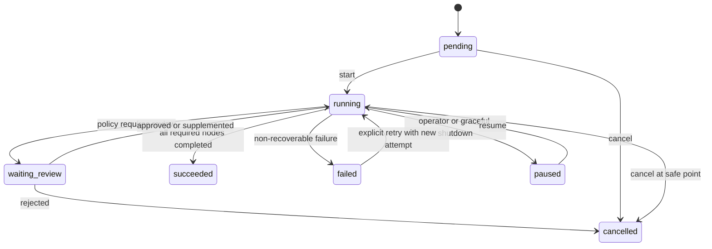
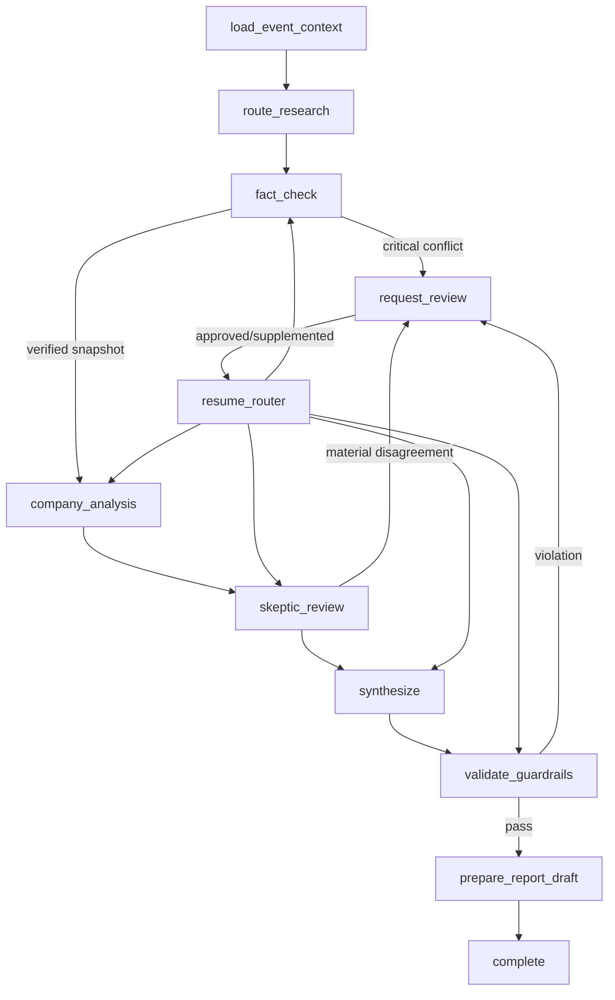

# DD-50 研究工作流详细设计

## 1. 目标与边界

研究工作流负责把事件、已验证事实和确定性金融数据编排为可审核的公司影响分析、反方审查和合成结论。MVP 不运行行业传导和完整市场预期 Agent，但在状态结构中预留可选槽位。

覆盖：FR-005、FR-006、AC-006～AC-010、NFR-002～NFR-004。

工作流不采集原始公告，不改变 Claim 内容或状态，不直接发布报告。发布和用户审核界面属于 DD-60。

## 2. 设计基线

- 每个 Event 的一次触发对应一个独立 WorkflowRun。
- Supervisor 是确定性路由器，模型不得自行增加节点或权限。
- Blackboard 是版本化结构化状态，不保存 Agent 间自由对话。
- Agent 只写自己拥有的字段，跨节点数据通过 Schema 校验。
- 数值计算必须通过工具完成；输出记录工具结果 ID。
- Synthesis 只能读取已有分析，不允许搜索和财务数据工具。

## 3. 组件划分

| 组件 | 职责 |
| --- | --- |
| WorkflowCommandService | 创建、暂停、恢复、取消和重分析 WorkflowRun |
| Supervisor | 根据状态、规则和预算选择下一节点 |
| GraphRunner | 执行 LangGraph 图、保存检查点和节点结果 |
| BlackboardRepository | 以版本和字段所有权更新共享状态 |
| AgentExecutor | 组装提示词、调用模型并校验输出 Schema |
| ToolGateway | 鉴权、限流、执行工具并记录 ToolCall |
| BudgetManager | 预留和结算 Token、费用、时间及调用次数 |
| ReviewPolicy | 判断是否暂停并创建 ReviewTask |
| ResultProjector | 将节点输出投影为 Analysis 和报告草稿输入 |

## 4. 工作流状态机



WorkflowRun 状态描述整个执行；节点状态使用 `pending | ready | running | waiting_review | succeeded | failed | skipped | cancelled`。工作流只有在所有必需节点成功或明确降级后才能 `succeeded`。

## 5. MVP 工作流图



`resume_router` 根据审核对象和 Blackboard 版本决定最小重跑节点，不固定返回某一节点。

## 6. 节点契约

| 节点 | 前置条件 | 写入字段 | 幂等键 | 自动重试 |
| --- | --- | --- | --- | --- |
| load_event_context | Event 可研究 | event_snapshot、execution_context | run+node+event_version | 数据库瞬时错误 3 次 |
| route_research | 上下文已加载 | execution_plan | run+node+router_version | Schema 修复 1 次 |
| fact_check | 路由要求且文档存在 | fact_check_snapshot | run+node+input_hash | 模型/网络错误 2 次 |
| company_analysis | 无 critical 冲突 | company_analysis | run+node+input_hash | 模型/网络错误 2 次 |
| skeptic_review | 公司分析有效 | counter_analysis | run+node+input_hash | 模型/网络错误 2 次 |
| synthesize | 必需分析完成 | synthesis | run+node+input_hash | Schema 修复 1 次 |
| validate_guardrails | synthesis 有效 | guardrail_result | run+node+policy_version | 不重试 |
| prepare_report_draft | guardrail 通过 | report_draft_ref | run+node+input_hash | 存储错误 3 次 |

`input_hash` 由该节点实际读取的 Blackboard 字段版本、Agent 配置、工具 Schema 和 Prompt 版本生成。未读取字段变化不应导致节点失效。

## 7. Blackboard 结构与所有权

```json
{
  "schema_version": "1.0.0",
  "workflow_id": "wfr_019...",
  "state_version": 7,
  "event_snapshot": {},
  "execution_context": {},
  "execution_plan": {},
  "fact_check_snapshot": {},
  "company_analysis": {},
  "counter_analysis": {},
  "synthesis": {},
  "guardrail_result": {},
  "report_draft_ref": null
}
```

| 字段 | 唯一写入者 | 读取者 |
| --- | --- | --- |
| event_snapshot | load_event_context | 全部研究节点 |
| execution_context | WorkflowCommandService/BudgetManager | Supervisor、全部节点 |
| execution_plan | route_research | Supervisor、GraphRunner |
| fact_check_snapshot | fact_check | company、skeptic、synthesis |
| company_analysis | company_analysis | skeptic、synthesis |
| counter_analysis | skeptic_review | synthesis、guardrail |
| synthesis | synthesize | guardrail、report draft |
| guardrail_result | validate_guardrails | Supervisor、report draft |
| report_draft_ref | prepare_report_draft | DD-60 发布流程 |

Blackboard 更新必须带 `expected_state_version` 和字段所有者身份。Repository 拒绝非所有者写入及对已提交节点结果的就地修改；重跑生成新 NodeAttempt，并用字段版本指向新结果。

## 8. 执行计划

MVP 的 Router 输出确定性受限结构：

```json
{
  "required_nodes": ["fact_check", "company_analysis", "skeptic_review", "synthesize"],
  "optional_nodes": [],
  "importance": 0.82,
  "urgency": "high",
  "budget_profile": "mvp_high",
  "review_policy": "standard_v1",
  "reasons": ["业绩变化幅度超过配置阈值"]
}
```

Router 只能从注册表选择节点和预算配置。未知节点、越权工具或超出事件类型允许集合的计划直接拒绝。

## 9. Supervisor 路由规则

Supervisor 每次节点完成后按以下顺序决策：

1. 检查取消、暂停和硬预算信号。
2. 校验节点输出及 Blackboard 版本。
3. 检查 critical/major 冲突和 ReviewPolicy。
4. 选择依赖全部满足的下一个节点。
5. 判断可选节点应执行、跳过还是降级。
6. 所有必需节点完成后执行 Guardrail 和报告草稿准备。

路由规则是版本化代码和配置，不使用开放式模型推理。模型 Router 只提供受 Schema 约束的建议，Supervisor 拥有最终决定权。

## 10. 预算管理

预算维度：`model_calls`、`tool_calls`、`input_tokens`、`output_tokens`、`cost_minor_units`、`elapsed_seconds`。

每个节点启动前预留预算，结束后按实际值结算。预算配置包括：

- 软阈值：禁止扩展检索或可选节点，继续完成必需节点。
- 硬阈值：停止新调用，在安全点检查点化并进入 `waiting_review` 或事实卡片降级。
- 节点上限：防止单个 Agent 消耗整个事件预算。

预算提升属于人工审核决定，必须记录操作者、原因和新增额度。模型不得请求无限预算。

## 11. Agent 执行与 Schema

### 11.1 Company Analyst

输入只包含事件快照、已验证事实、经工具返回的历史财务数据及计算结果。输出 Schema：[company-analysis-output.schema.json](./schemas/company-analysis-output.schema.json)。

必须区分：直接事实、分析假设、计算结果和分析推论。若关键财务数据缺失，返回 `partial`，不能让模型估造数字。

### 11.2 Skeptic

输入包含 Company Analysis、事实快照及其引用。输出 Schema：[skeptic-output.schema.json](./schemas/skeptic-output.schema.json)。

Skeptic 可请求已授权的证据查询，但不得改写 Company Analysis。它提出反证、脆弱假设和建议置信度；最终置信度由合成和 Guardrail 规则决定。

### 11.3 Synthesizer

输入仅为 Blackboard 中已校验的结构化结果。输出 Schema：[synthesis-output.schema.json](./schemas/synthesis-output.schema.json)。

禁止开放检索、行情查询和新增事实。输出中的每项事实只能引用持久化 Claim ID，每个核心判断必须引用 Analysis ID 或列出假设 ID。

## 12. 工具权限

| Agent | 允许工具 | 禁止工具 |
| --- | --- | --- |
| Fact Checker | 公告检索、文档块、证据提交 | 行情、影响计算、发布 |
| Company Analyst | 财务报表、指标计算、相似历史事件 | 任意网页、发布、Claim 状态变更 |
| Skeptic | 读取证据、财务数据、历史事件 | 修改已有分析、发布 |
| Synthesizer | 读取 Blackboard 和引用解析 | 所有搜索、行情和写业务数据工具 |

ToolGateway 对每次调用校验 Agent 身份、WorkflowRun、工具白名单、参数 Schema、`as_of` 和剩余预算。

## 13. 人工审核与恢复

触发条件：

- Fact Check 存在 critical 冲突。
- Company Analyst 缺少决定性财务数据但事件重要度高。
- Skeptic 建议方向反转，或建议置信度比原分析下降超过配置阈值。
- Agent 输出连续两次 Schema 失败。
- Guardrail 检出无 Claim 引用、敏感措辞或事实与推论混淆。
- 硬预算耗尽但高重要度事件尚未形成安全降级结果。

ReviewTask 保存 `object_type`、`object_id`、`reason_code`、`resume_from`、Blackboard 版本和允许决定。审核结果不能直接修改历史节点输出，只能追加人工意见、补充数据或触发新 NodeAttempt。

## 14. 局部重跑和失效传播

| 变化 | 最小失效范围 |
| --- | --- |
| 新增不影响核心结论的 context Evidence | 不自动重跑 |
| Claim 状态或值变化 | company → skeptic → synthesis → guardrail |
| 财务数据版本变化 | company → skeptic → synthesis → guardrail |
| Company Analysis 人工退回 | company → skeptic → synthesis → guardrail |
| 仅 Prompt/模型版本升级 | 不改历史；显式创建新 WorkflowRun |
| Guardrail 策略升级 | guardrail → report draft |

重跑创建新的 WorkflowRun 或同一运行下的新 NodeAttempt，由触发类型决定；已发布报告必须通过 DD-60 创建新版本，不能原地更新。

## 15. 持久化与检查点

每个节点在以下时点保存检查点：调用前预算预留后、工具调用完成后、Agent 输出校验后、Blackboard 提交后。检查点至少包含图版本、当前节点、Blackboard 版本、NodeAttempt、未结算预算和待处理外部调用引用。

模型响应和大型工具结果存对象存储；PostgreSQL 保存 Hash、URI、Schema 版本和摘要。恢复时不重复已成功且幂等的外部调用。

## 16. 错误分类与降级

| 错误 | 处理 |
| --- | --- |
| `MODEL_TRANSIENT` | 节点内指数退避，最多 2 次 |
| `OUTPUT_SCHEMA_INVALID` | 带校验错误修复 1 次，之后审核 |
| `TOOL_DATA_UNAVAILABLE` | 必需数据则 partial/审核；非必需则跳过 |
| `TOOL_AS_OF_VIOLATION` | 不重试，记录安全事件并失败 |
| `BUDGET_HARD_LIMIT` | 检查点化并审核或事实卡片降级 |
| `BLACKBOARD_VERSION_CONFLICT` | 重新读取并重算路由，不重复模型调用 |
| `POLICY_VIOLATION` | 阻止报告草稿并审核 |

当 Company Analysis 无法安全生成时，可以只输出 DD-40 的事实卡片；系统必须标记 `degraded_mode=fact_only`。

## 17. 领域事件

- `workflow.started.v1`
- `workflow.node_completed.v1`
- `workflow.review_requested.v1`
- `workflow.resumed.v1`
- `workflow.succeeded.v1`
- `workflow.failed.v1`
- `analysis.company_completed.v1`
- `analysis.skeptic_completed.v1`
- `analysis.synthesis_completed.v1`

所有消息通过 Outbox 发布，payload 只携带标识、版本和摘要，不携带完整模型正文。

## 18. 可观测性

- `workflow_duration_seconds{event_type,result}`
- `workflow_node_duration_seconds{node,result}`
- `workflow_budget_usage{dimension,budget_profile}`
- `workflow_review_rate{reason_code,event_type}`
- `agent_schema_failures_total{agent,schema_version}`
- `tool_calls_total{agent,tool,result}`
- `workflow_recovery_total{from_node,result}`
- `analysis_degraded_total{mode,event_type}`

Trace 串联 Event、WorkflowRun、NodeAttempt、AgentRun、ToolCall、Claim 和报告草稿。

## 19. 测试设计

- 正常执行、事实冲突、数据缺失、Skeptic 方向反转和 Guardrail 拦截。
- 每个节点重复投递、进程中断、检查点恢复和 Blackboard 版本冲突。
- Schema 修复成功、连续失败和未知字段拒绝。
- Token、费用、时间、工具调用软硬预算边界。
- 非授权工具、`as_of` 越界和文档提示词注入。
- Claim 或财务数据变化后的最小失效传播。
- 模型版本变化不覆盖历史 AgentRun 和报告。
- 事实卡片降级不会被标记为完整研究报告。

## 20. 待确认事项

- LangGraph 的 PostgreSQL Checkpointer 版本与并发语义验证。
- MVP 各预算 Profile 的具体额度和成本币种。
- Company Analyst 首期可用财务工具和数据授权范围。
- Skeptic 触发强制审核的置信度下降阈值。
- 同一 Event 是否允许人工启动并行研究分支；当前基线只允许一个主写工作流。

