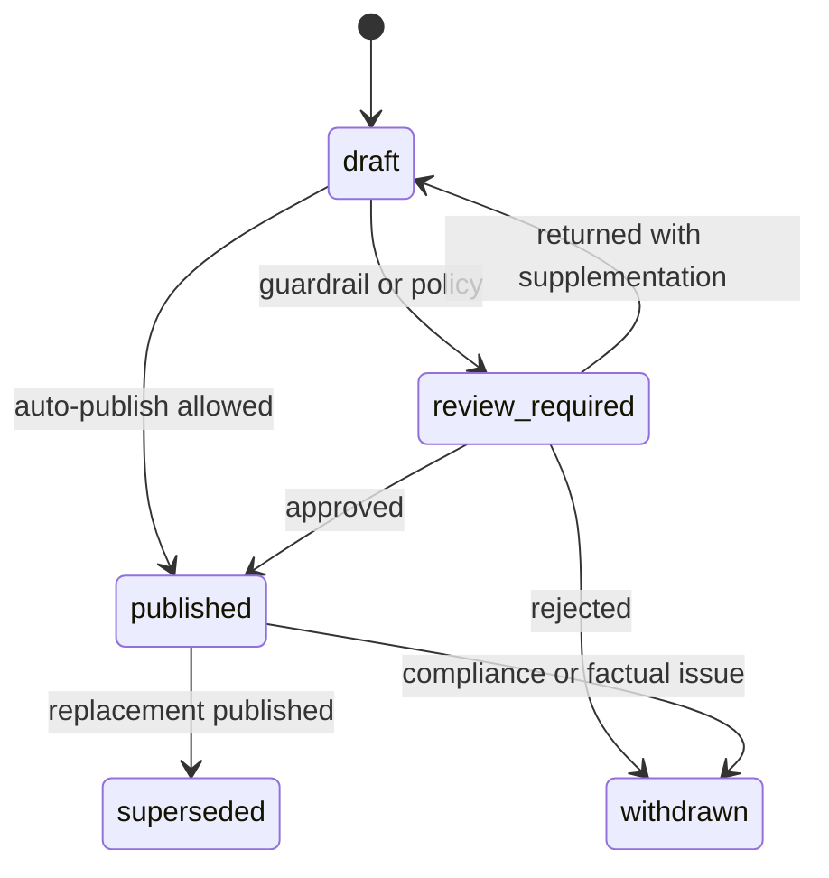

# DD-60 报告与审核详细设计

## 1. 目标与边界

本模块将已通过研究工作流校验的结构化结果转换为事实卡片或研究卡片，执行发布前 Guardrail，承载人工审核、版本比较、撤回、替代和每日简报。它不新增事实、不重新运行研究 Agent，也不执行交易。

覆盖：FR-006～FR-008、AC-008～AC-011、NFR-003、NFR-005、NFR-006。

## 2. 组件

| 组件 | 职责 |
| --- | --- |
| ReportAssembler | 从 Blackboard 投影报告草稿，不进行开放式生成 |
| CitationResolver | 把 Claim ID 解析为 Evidence 定位和授权展示内容 |
| GuardrailEngine | 检查引用、状态、措辞、置信度和许可 |
| ReviewService | 创建任务、校验决定并恢复工作流或发布流程 |
| PublicationService | 原子发布、撤回和替代报告版本 |
| BriefService | 从已发布报告生成去重 Top 10 简报 |
| VersionDiffService | 计算事实、方向、置信度和观察项变化 |

## 3. 报告类型与状态

- `fact_card`：只包含已验证事实、冲突和待验证事项，不表达影响方向。
- `research_card`：包含公司影响、反方观点、合成结论及触发条件。



已发布内容不可修改。纠错创建新版本并使用 `supersedes_id`；撤回保留审计和替代说明。

## 4. 报告装配规则

ReportAssembler 只接受持久化的 Claim、Analysis 和 GuardrailResult ID：

- 摘要中的数字和主体必须来自 `verified` Claim。
- `conflicted` Claim 只能进入冲突区，`unverified` 只能进入待验证区。
- 核心判断必须关联 Company/Skeptic/Synthesis Analysis ID。
- `fact_only` 工作流只能生成事实卡片。
- 数据截止时间取 WorkflowRun `as_of`，不得取发布时间或当前时间代替。

报告草稿契约见 [report-draft.schema.json](./schemas/report-draft.schema.json)。

## 5. Guardrail

规则按固定顺序执行，并输出版本化结果：

| 规则 | 失败处理 |
| --- | --- |
| 关键事实均有有效 Claim 和 Evidence | 阻止发布 |
| 引用 Revision 在 `as_of` 前可用 | 阻止发布并记录安全事件 |
| 不含自动交易、仓位或保证收益措辞 | 阻止发布并人工审核 |
| 事实、假设、推论分区明确 | 退回装配或审核 |
| 低置信度不使用强方向标签 | 自动降级标签或审核 |
| 授权内容片段符合展示范围 | 收缩展示或阻止发布 |
| 必填免责声明、版本和时间齐全 | 自动补齐确定性字段 |

模型可辅助敏感措辞分类，但规则引擎拥有最终阻断权。Guardrail 输出每条规则的 `pass/fail/warn`、对象 ID 和修复建议。

## 6. 审核流程

审核任务锁定待审对象版本，决定契约见 [review-decision.schema.json](./schemas/review-decision.schema.json)。允许决定：

- `approve`：批准当前版本。
- `return_for_supplement`：追加意见并从指定节点重跑。
- `downgrade_to_fact_card`：移除分析结论后重新执行 Guardrail。
- `reject`：终止发布，保留草稿和理由。
- `withdraw`：撤回已发布版本，仅限合规或事实问题。

审核员不能直接改写 Claim、Analysis 或 Agent 输出。所有决定要求 `expected_version`，并记录审核人、角色、理由和时间。

## 7. 发布事务

发布事务同时完成：

1. 校验 Guardrail 版本、审核决定和报告草稿 Hash。
2. 将 ReportVersion 状态改为 `published`。
3. 若为替代版本，将旧版本改为 `superseded`。
4. 创建 Publication 记录和 Outbox 消息。
5. 提交后由消费者更新查询投影和通知队列。

重复发布使用 `(report_version_id, channel)` 幂等键，不重复产生通知。

## 8. 每日 Top 10

候选只来自当日已发布且允许进入简报的报告。初始排序分：

```text
brief_score = 0.40 * importance
            + 0.20 * urgency
            + 0.20 * confidence
            + 0.10 * novelty
            + 0.10 * recency
```

同一 Event 只保留最新版本；同一公司默认最多两条，除非存在 critical 事件。Brief 保存候选集、分数、规则版本和最终顺序，不重新调用研究 Agent。

## 9. 查询与命令接口

- `GET /api/v1/events/{event_id}/reports`：报告版本列表。
- `GET /api/v1/reports/{report_version_id}`：报告及可展示引用。
- `GET /api/v1/reports/{id}/diff?against=`：版本差异。
- `GET /api/v1/reviews?status=pending`：审核队列。
- `POST /api/v1/reviews/{id}/decision`：提交审核决定。
- `GET /api/v1/briefs/daily?date=`：每日简报。

公开查询不返回模型提示词、内部推理、授权全文或未脱敏工具参数。

## 10. 权限

| 操作 | researcher | reviewer | publisher | admin |
| --- | --- | --- | --- | --- |
| 查看内部报告 | 允许 | 允许 | 允许 | 按需 |
| 提交审核意见 | 不允许 | 允许 | 不允许 | 不允许 |
| 发布/撤回 | 不允许 | 不允许 | 允许 | 不允许 |
| 管理来源与配置 | 不允许 | 不允许 | 不允许 | 允许 |

同一用户默认不能同时审核并发布同一高风险报告；例外需双人授权和审计。

## 11. 失败与恢复

- 引用解析失败：阻止发布，保留草稿。
- 通知失败：不回滚已发布报告，独立重试通知。
- 发布事务冲突：重新读取版本，不自动覆盖审核决定。
- Brief 生成失败：可重放同一候选快照，排序结果应一致。
- 已发布报告发现关键事实错误：立即撤回，创建纠正工作流，不删除旧版本。

## 12. 测试设计

- 完整研究卡片、事实卡片和低置信度降级。
- 无引用、失效 Revision、未来证据和授权片段越界。
- 审核批准、退回、降级、拒绝、撤回及并发版本冲突。
- 发布重复请求、Outbox 重放和通知失败。
- 替代版本差异及旧版本审计可见性。
- Top 10 去重、公司上限、稳定排序和历史重放。
- RBAC、职责分离和敏感内容脱敏。

## 13. 待确认事项

- MVP 是否自动发布低风险事实卡片；当前基线为允许，研究卡片需审核。
- 对外用户是否存在；当前按内部研究平台设计。
- 报告导出和分享渠道及其授权水位。
- Top 10 排序权重是否允许研究负责人配置。

