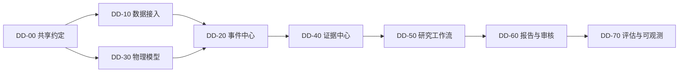

# 详细设计总览

## 1. 文档定位

本目录是 L3 详细设计层，承接产品需求、功能架构、数据模型和工程设计。文档按业务功能域组织，不按 Agent 名称组织；每份设计必须覆盖职责边界、组件、接口、时序、状态、失败处理和测试点。

## 2. 设计索引

| 编号 | 文档 | 覆盖需求 | 状态 |
| --- | --- | --- | --- |
| DD-00 | [共享约定](./00-shared-conventions.md) | 全部 P0 | 初稿 |
| DD-10 | [数据接入详细设计](./10-ingestion.md) | FR-001、AC-001 | 初稿 |
| DD-20 | [事件中心详细设计](./20-event-center.md) | FR-002、FR-003、AC-002～AC-004 | 初稿 |
| DD-30 | [MVP 物理数据模型](./30-storage-schema.md) | AC-001～AC-004、NFR-003～NFR-004 | 初稿 |
| DD-40 | [证据中心详细设计](./40-evidence-center.md) | FR-004、AC-005、AC-011 | 初稿 |
| DD-50 | [研究工作流详细设计](./50-research-workflow.md) | FR-005～FR-006、AC-006～AC-010 | 初稿 |
| DD-60 | [报告与审核详细设计](./60-reporting-review.md) | FR-006～FR-008、AC-008～AC-011 | 初稿 |
| DD-70 | [评估与可观测详细设计](./70-evaluation-observability.md) | FR-010、NFR-001～NFR-007 | 初稿 |

“初稿”表示可用于接口评审，但仍需关闭文档中的待确认事项；“已评审”后才作为实现基线。

## 3. 依赖顺序

## 4. 评审门槛

- 每个接口均有请求、响应、错误码和幂等语义。
- 每个状态均有唯一拥有者和合法迁移。
- 每个写入流程均说明事务边界及消息一致性。
- 每个外部依赖均有超时、重试、限流和降级策略。
- 设计项能映射到 `FR-*`、`AC-*` 或 `NFR-*`。
- 测试覆盖正常路径、重复请求、部分失败和恢复路径。
- 待确认事项有决策负责人，不把未确认假设隐藏在代码中。

## 5. 变更规则

实现细节变化只更新对应 DD 文档；跨模块边界或技术选型变化同时更新[架构决策记录](../06-architecture-decisions.md)。数据库和消息的不兼容变更必须提供迁移、兼容窗口和回滚方案。
