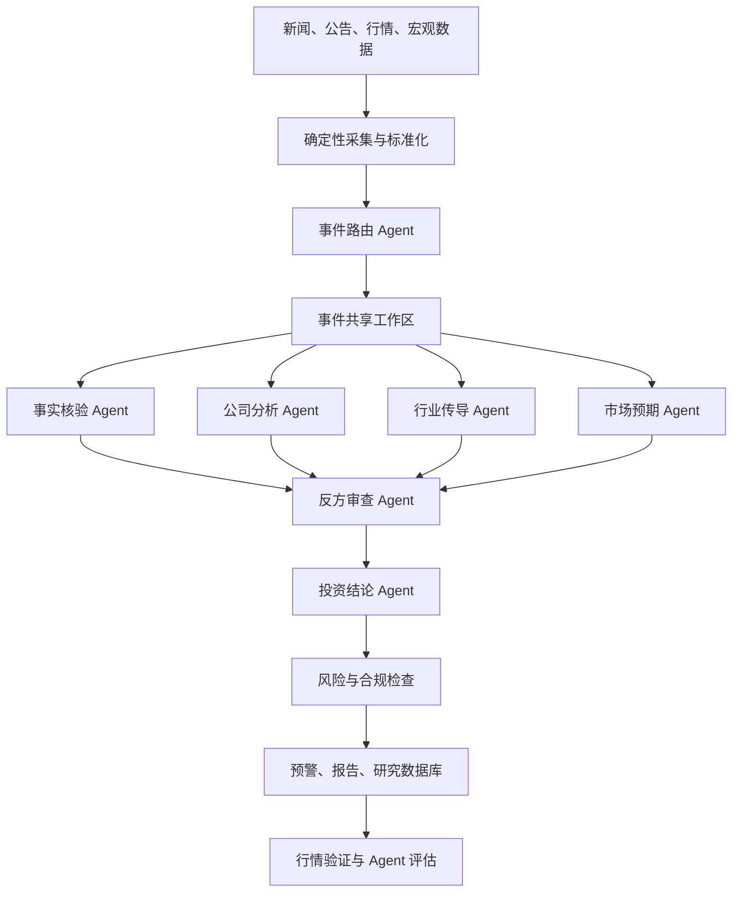
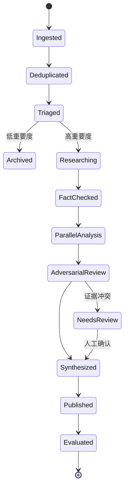

# 基于 Multi-Agent 的金融资讯分析系统设计

> 文档定位：总体方案与设计原则。功能边界、数据模型、工作流、工程接口和交付标准分别维护在当前 [`docs/`](./README.md) 目录下，避免总体设计与实现细节混杂。

## 文档导航

- [文档总览](./README.md)
- [产品需求与用户旅程](./00-product-requirements.md)
- [功能架构与模块拆分](./01-functional-architecture.md)
- [核心数据模型](./02-data-model.md)
- [事件工作流与 Agent 编排](./03-workflow-design.md)
- [接口、工程与运行设计](./04-engineering-design.md)
- [MVP 范围与验收标准](./05-mvp-acceptance.md)
- [详细设计](./design/README.md)
- [架构决策记录](./06-architecture-decisions.md)
- [工作进度清单](./07-work-progress.md)
- [改进项 Backlog](./08-improvement-backlog.md)

---

## 1. 设计目标

本系统将传统的“金融新闻聚合器”升级为一个**事件驱动的虚拟投研团队**。系统围绕四个核心问题展开：

1. 发生了什么？
2. 影响哪些公司、行业和资产？
3. 影响程度和持续时间如何？
4. 市场是否已经提前定价？

核心设计原则是：

> 每个金融事件创建一个独立、可追踪、可暂停、可恢复、可复盘的 Agent Workflow。

Agent 负责理解、检索、分析、质疑和综合结论；确定性程序负责数据采集、清洗、计算、权限、存储、重试和风险控制。

---

## 2. 总体系统架构



系统不应让一个通用 Agent 自由处理所有任务，而应采用：

- 事件驱动工作流
- Supervisor + Specialist Agents
- 共享结构化状态
- 工具权限隔离
- 证据强制引用
- 人工审批节点
- 全链路追踪和离线评估

---

## 3. 数据源分级

不同来源不能被视为同等可信，应建立来源等级：

| 等级 | 来源 | 主要用途 |
| --- | --- | --- |
| S | 交易所、监管机构、上市公司公告、统计机构 | 事实基准 |
| A | 主流财经媒体、公司官网 | 新闻确认和背景信息 |
| B | 券商研报、行业媒体、专家观点 | 预期、解释和行业判断 |
| C | 社交媒体、自媒体、论坛 | 情绪和线索，不直接作为事实结论 |

中国市场可优先接入巨潮资讯、上交所、深交所、国家统计局、央行等官方来源；美股可接入 SEC EDGAR、公司投资者关系页面以及宏观数据接口。

---

## 4. Agent 团队设计

### 4.1 Event Router Agent：事件路由与调度

Event Router 是分析系统入口，但不负责深度研究。

主要职责：

- 判断资讯是否值得进一步分析
- 识别事件类型和涉及实体
- 识别涉及的市场、行业和资产
- 判断重要度、紧急度和分析预算
- 决定需要调用哪些专业 Agent
- 低价值信息直接归档

结构化输出示例：

```json
{
  "event_id": "evt_20260710_001",
  "event_type": "earnings_guidance",
  "entities": [
    {"type": "company", "id": "002335.SZ"},
    {"type": "industry", "id": "data_center_power"}
  ],
  "importance": 0.87,
  "urgency": "high",
  "required_agents": [
    "fact_checker",
    "company_analyst",
    "industry_analyst",
    "expectation_analyst"
  ],
  "reason": "业绩预告明显高于历史增速，可能影响行业估值"
}
```

### 4.2 Fact Verification Agent：事实核验

这是系统中优先级最高的 Agent。

主要职责：

- 查找原始公告、监管文件和公司披露
- 区分事实、媒体解释、观点与传闻
- 对比多个独立来源
- 发现数字、时间和主体冲突
- 标记无法验证的信息
- 为每项事实保留原文证据和出处

该 Agent 不能输出买卖建议，只能输出经过验证的事实：

```json
{
  "verified_facts": [
    {
      "claim": "公司预计净利润同比增长62%至99%",
      "source_type": "exchange_filing",
      "source_url": "https://example.com/filing",
      "evidence": "公告原文片段",
      "confidence": 0.98
    }
  ],
  "conflicts": [],
  "unverified_claims": [
    "新产品已获得海外大客户订单"
  ]
}
```

### 4.3 Company Analyst Agent：公司基本面分析

主要职责：

- 分析对收入、利润、毛利率和现金流的影响
- 判断影响是一次性还是可持续
- 查找公司历史上的相似事件
- 建立乐观、基准和悲观情景
- 估算不同情景下的财务变化
- 分析当前估值是否已经反映事件影响

| 情景 | 关键假设 | 财务影响 | 主要风险 |
| --- | --- | ---: | --- |
| 乐观 | 需求持续、毛利率提升 | EPS +15% | 估值过高 |
| 基准 | 增长部分持续 | EPS +7% | 市场已有预期 |
| 悲观 | 收益主要来自一次性项目 | EPS +1% | 后续季度回落 |

涉及数值计算时，Agent 必须调用财务计算工具，不应依靠语言模型心算。

### 4.4 Industry Propagation Agent：行业传导分析

该 Agent 回答：“除了新闻中直接出现的公司，还有谁会受到影响？”

分析范围包括：

- 上游原材料和关键零部件
- 下游客户和应用领域
- 同行业竞争者
- 替代产品和替代技术
- 区域供应链
- 政策、汇率和技术依赖
- 潜在受益者与受损者

示例传导链：

```text
数据中心电力需求增长
        ↓
UPS、电源设备需求上升
        ↓
功率半导体、变压器、铜需求变化
        ↓
数据中心运营商资本开支和成本变化
```

该 Agent 应优先查询行业知识图谱和结构化供应链数据，而不是仅依赖向量搜索。

### 4.5 Market Expectation Agent：预期差分析

金融事件分析的重点不是简单判断“利好或利空”，而是判断结果相对市场原有预期的偏差。

需要使用的数据包括：

- 分析师一致预期
- 历史财务数据
- 公告前价格和成交量变化
- 资金流数据
- 期权隐含波动率
- 新闻发布时间
- 搜索热度和市场情绪

建议评分：

```text
Impact = Surprise × Relevance × Credibility × Novelty × Persistence
```

- `Surprise`：实际结果相对市场预期的偏差
- `Relevance`：与公司收入、利润和估值的关联度
- `Credibility`：来源等级及多源验证情况
- `Novelty`：首次披露还是旧闻重发
- `Persistence`：短期情绪还是中长期影响

结构化输出示例：

```json
{
  "fundamental_direction": "positive",
  "surprise_score": 0.74,
  "priced_in_score": 0.58,
  "expected_horizon": "5-20 trading days",
  "market_interpretation": "基本面超预期，但公告前股价已有明显上涨",
  "confidence": 0.71
}
```

### 4.6 Skeptic Agent：反方审查

Skeptic Agent 专门攻击其他 Agent 的分析结论，减少集体偏见和自我强化。

它需要检查：

- 是否忽略了反面证据
- 是否将相关性误认为因果关系
- 利好或利空是否已经被市场定价
- 多个来源是否只是相互转载
- 利润是否来自非经常性损益
- 是否存在幸存者偏差或未来数据泄漏
- 哪个关键假设错误时会导致结论反转

```json
{
  "counter_arguments": [
    "利润增长中约40%来自一次性投资收益",
    "股价在公告前十个交易日已经上涨22%"
  ],
  "thesis_breakers": [
    "下一季度主营业务毛利率低于18%",
    "新增订单未在半年报中确认"
  ],
  "revised_confidence": 0.59
}
```

### 4.7 Investment Synthesis Agent：分析结论合成

该 Agent 不再进行新的开放式搜索，而是综合前面 Agent 的结构化结果。

输出内容包括：

- 事件摘要
- 已验证的关键事实
- 受影响公司和行业
- 基本面影响
- 市场预期差
- 时间范围
- 正反方观点
- 置信度
- 后续验证指标
- 触发重新分析的条件

```json
{
  "signal": "moderately_positive",
  "confidence": 0.67,
  "horizon": "medium_term",
  "already_priced_in": "partially",
  "watch_items": [
    "季度主营业务毛利率",
    "海外订单确认情况",
    "行业新增产能"
  ],
  "reanalysis_triggers": [
    "公司发布业绩修正公告",
    "股价相对行业指数变化超过10%",
    "出现监管问询"
  ]
}
```

---

## 5. Agent 协作机制

不建议采用完全开放的多 Agent 自由对话。系统应采用 **Supervisor + Blackboard** 模式。

### 5.1 Supervisor

Supervisor 负责：

- 决定调用哪些 Agent
- 控制执行顺序和并行关系
- 限制最大循环次数
- 控制 Token、时间和工具预算
- 处理失败、超时和重试
- 判断是否需要人工介入
- 终止低价值或失控任务

### 5.2 Blackboard

所有 Agent 共享一个结构化事件状态，但每个 Agent 只能写入自己负责的字段：

```json
{
  "event": {},
  "sources": [],
  "verified_facts": [],
  "entity_links": [],
  "company_analysis": {},
  "industry_analysis": {},
  "market_expectation": {},
  "counter_analysis": {},
  "final_report": {},
  "audit": {
    "agent_runs": [],
    "tool_calls": [],
    "model_versions": []
  }
}
```

通过结构化共享状态，可以避免 Agent 之间使用自然语言反复传递信息造成事实遗漏和语义漂移。

---

## 6. 完整工作流程



典型执行过程：

1. 采集服务发现一篇新公告或新闻。
2. 规则引擎完成格式化、Hash 去重和时间校验。
3. Router Agent 判断事件类型、重要度和需要的 Agent。
4. 系统创建独立事件工作流。
5. Fact Verification Agent 找到并核验原始公告。
6. 公司、行业、宏观和市场 Agent 并行研究。
7. Skeptic Agent 查找反证并调整置信度。
8. Synthesis Agent 生成最终研究结论。
9. 风控规则检查引用、措辞和风险等级。
10. 结果发布到个股页面、预警系统和每日简报。
11. 在后续 1、3、5、20 个交易日自动评估分析结果。

---

## 7. 工具层设计

Agent 不应直接无限制访问互联网、文件系统或业务数据库，应通过窄化的工具接口获取数据：

```text
search_official_filings()
search_financial_news()
get_company_profile()
get_financial_statements()
get_consensus_estimates()
get_market_prices()
get_industry_relationships()
calculate_financial_metrics()
find_similar_events()
run_event_backtest()
save_agent_result()
request_human_review()
```

每个工具应具备：

- 严格的参数和返回值 Schema
- 来源和权限控制
- 超时、重试和熔断
- 返回数据量限制
- 查询缓存
- 调用审计日志
- 数据版本号
- 明确的错误类型

行情、财务指标等精确数据应由工具返回，Agent 不应自行抓取网页并猜测数值。

---

## 8. 记忆系统设计

不同类型的记忆应使用不同存储方式，不能全部放入向量数据库。

| 记忆类型 | 保存内容 | 推荐存储 |
| --- | --- | --- |
| 工作记忆 | 当前事件状态和执行进度 | Redis / Workflow State |
| 事实记忆 | 公司、人物、行业和供应链关系 | PostgreSQL + Knowledge Graph |
| 语义记忆 | 新闻、公告和研报全文 | OpenSearch + pgvector |
| 经验记忆 | 历史 Agent 判断及市场结果 | PostgreSQL / ClickHouse |

历史判断必须保存生成时的原始版本，不能根据后续行情覆盖，否则回测会产生未来信息泄漏。

---

## 9. 长期事件与 Agent 唤醒

金融事件经常持续数周或数月，例如：

- 市场传闻
- 公司回应
- 股票停牌
- 正式公告
- 交易所问询
- 股东大会批准
- 交易完成或终止

因此，事件工作流在生成首次报告后不应被删除，而应进入休眠状态。新证据到来时重新唤醒：

```text
新信息到达
   ↓
实体和事件匹配
   ↓
检查是否改变原有事实或结论
   ↓
局部重新运行相关 Agent
   ↓
生成结论变更记录和新预警
```

每次结论变化都应记录：

- 发生变化的事实
- 旧结论与新结论
- 置信度变化
- 重新分析原因
- 触发该变化的数据来源

---

## 10. 风险控制

金融场景中的 Agent 能力需要严格分级：

| 操作 | 是否允许自动执行 |
| --- | --- |
| 新闻分类 | 可以 |
| 高置信度事件合并 | 可以 |
| 事实抽取 | 可以，但必须引用来源 |
| 研究报告生成 | 可以 |
| 用户预警 | 可以 |
| 修改投资组合 | 不可以 |
| 执行交易 | 必须人工批准 |
| 自动提高仓位 | 不可以 |

任何涉及交易、资金或不可逆行为的操作，都必须暂停工作流并等待人工明确批准。

还应设置以下系统级限制：

- 单事件最大 Agent 调用次数
- 单事件最大 Token 和费用预算
- 最大研究时间
- 低置信度禁止生成强结论
- 关键数字必须来自工具或原始文件
- 无来源事实禁止进入最终报告
- Agent 不得自行扩大工具权限
- 所有模型、提示词和数据版本必须可追踪

---

## 11. 推荐技术栈

```text
前端：
Next.js + ECharts

接口层：
FastAPI

Agent 编排：
LangGraph

模型访问：
OpenAI Agents SDK 或统一 Model Gateway

消息与任务：
Redis Streams / Kafka

业务数据库：
PostgreSQL

全文搜索：
OpenSearch

向量检索：
pgvector

行情和历史事件分析：
ClickHouse + Polars

对象存储：
MinIO / S3

可观测：
OpenTelemetry + Grafana / LangSmith
```

MVP 阶段建议保持简单：

```text
FastAPI + LangGraph + PostgreSQL + Redis + pgvector
```

当工作流规模、执行时间和失败恢复要求明显增加后，再引入 Kafka、ClickHouse 或 Temporal。

---

## 12. 推荐项目结构

```text
FinSightAgent/
├── app/
│   ├── ingestion/       # 来源、采集、标准化与去重
│   ├── events/          # 事件发现、聚类、实体对齐与生命周期
│   ├── evidence/        # 原始证据、事实声明与冲突管理
│   ├── research/        # 工作流、Agent、工具与分析结果
│   ├── publishing/      # 研究卡片、简报与预警
│   ├── monitoring/      # 事件触发器与局部重分析
│   ├── evaluation/      # 离线、在线和市场验证
│   ├── platform/        # 配置、权限、审计与可观测性
│   └── api/             # FastAPI 路由与外部契约
├── tests/               # 单元、契约、集成与工作流测试
├── migrations/          # 数据库版本变更
├── deploy/              # 本地和生产部署配置
└── docs/                # 分层设计与决策记录
```

代码按业务功能域组织；Agent 是 `research` 域中的执行组件，而不是整个系统的顶层模块。详细边界见[功能架构与模块拆分](./01-functional-architecture.md)。

---

## 13. Agent 评估体系

不能仅通过“报告看起来是否专业”评价 Agent，应建立可量化评估。

### 13.1 数据与抽取指标

- 重要事件召回率
- 事件分类准确率
- 跨来源去重率
- 实体映射准确率
- 事实抽取准确率
- 引用与原文一致率
- 传闻误判为事实的比例

### 13.2 分析质量指标

- 方向判断准确率
- 置信度校准误差
- 反方证据召回率
- 预期差识别准确率
- 高置信度结论命中率
- 研究员对分析结论的接受率

### 13.3 市场验证指标

- 事件后 1、3、5、20 日超额收益
- 相对行业和指数的异常收益
- 不同事件类型的有效期
- 不同来源等级的信号质量
- 高分事件与低分事件的收益区分度

### 13.4 系统指标

- 从新闻出现到预警生成的延迟
- 单事件平均成本
- Agent 工具调用失败率
- 工作流恢复成功率
- 人工审核比例
- 每类错误的来源分布

系统评估应区分：

1. 数据错误
2. 事实核验错误
3. 推理错误
4. 市场已经定价
5. 分析正确但时间范围判断错误

---

## 14. MVP 落地路线

第一版只实现一条完整、高价值链路：

```text
上市公司公告
    ↓
事件识别
    ↓
事实核验
    ↓
公司影响分析
    ↓
反方审查
    ↓
结构化研究卡片
```

第一阶段仅支持五类事件：

1. 业绩预告
2. 重大合同
3. 并购重组
4. 股东减持
5. 监管处罚

第一阶段交付能力：

- 接入 RSS 与交易所公告
- 新闻去重和事件聚类
- 股票与行业实体对齐
- 五类事件结构化抽取
- 原始证据引用
- 公司基本面影响分析
- Skeptic Agent 反方审查
- 个股事件时间线
- 每日 Top 10 事件简报
- Agent 运行记录和基础评估

在该链路稳定后，再依次增加：

1. 行业和供应链传导
2. 宏观政策分析
3. 市场预期与定价分析
4. 自动重新唤醒和持续跟踪
5. 自选股与投资组合影响分析
6. 事件回测与评分自动校准

在接入自动交易前，应先运行至少一段时间的影子评估或模拟盘，确认高置信度事件具有稳定的信息价值。

---

## 15. 核心结论

这个系统真正的竞争力不在于 Agent 数量，而在于：

> 高质量事件数据、严格证据链、结构化协作机制、历史研究资产，以及可量化的 Agent 评估体系。

推荐以“单事件、单工作流、可回放”为基本单位，先把事实核验和研究闭环做扎实，再逐步增加更多专业 Agent 与自动化能力。
